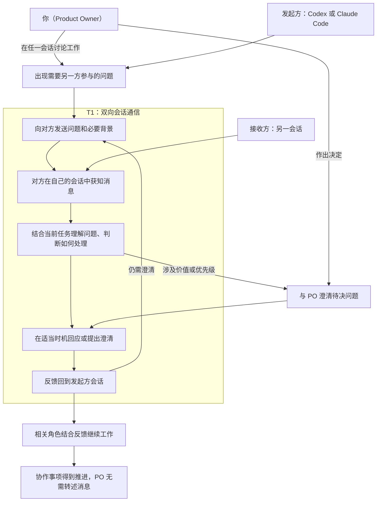

# Design Map

<small><em>本工作稿已根据深度研究与专家讨论修订。结论、证据边界及待验证事项见 <a href="deep-research/Synthesis.md">研究与专家讨论综合结论</a>。</em></small>

## 1. 挑战、目标与关键问题

### challenge

Codex 与 Claude Code 分处独立工具和会话中，如何让双方主动交换工作消息、获得所需反馈，并在你作为 Product Owner 的参与下接续推进同一项目？

<small><em>本轮聚焦独立会话之间的双向通信。各方通过明确发送的消息获得对方提供的内容；共同讨论现场留待未来考虑。共享项目文件仍可提供背景，共享讨论文件是否有必要尚未确定。</em></small>

### goal

让你、Codex 和 Claude Code 形成一个分工清楚、沟通顺畅的协作团队，能够共同澄清问题、讨论计划、参与评审，并将讨论结果落实为行动，持续推进项目、交付你认可的成果。

<small><em>这是长期目标。你决定价值方向与优先级；Codex 通常承担 Scrum Master，Claude Code 通常承担 Developer 或其他角色。本轮中，你可以在任一会话参与讨论，由该会话向另一方发送需要澄清的问题和背景，再将收到的意见用于继续讨论。</em></small>

### questions

1. 双方能否向对方现有会话送达消息，在空闲时触发模型调用，在工作中于当前模型调用及其工具执行结束后、下一次模型调用前将消息加入上下文？
2. 消息携带的信息及接收方可访问的项目材料，能否支持准确理解问题并给出有用的反馈？
3. 在独立会话的多轮往返中，双方能否清楚关联问题、回复与追问，识别已有结论和尚存的分歧？
4. 接收方能否结合当前任务判断如何处理消息，并由相应角色形成和接续明确的后续行动？
5. 这种直接通信能否减少你代为搬运消息和补充背景的负担，同时让你继续参与关键讨论、作出决策并把握进展？

<small><em>Q1 中的接收时机是 PO 已确认的需求，尚未完成符合该标准的双端实测；消息进入上下文后，接收方自行判断是否调整当前工作。本轮 Target 选择 Q1 和 Q3 中的多轮通信部分，Q2、Q4、Q5 保留为观察问题，不增加本轮验收门槛。</em></small>

## 2. map

参与者：你（Product Owner）、Codex、Claude Code。图中按本次消息的方向将 Codex 与 Claude Code 分为发起方和接收方，两者可以互换。

起点：一方在项目工作中遇到需要另一方参与的问题；这也可以来自你与该方的讨论。

结束状态：反馈回到发起方会话并用于推进协作事项，你无需代为搬运消息。

<small><em>此图呈现一轮期望的协作过程，共 9 个关键步骤。PO 可在任一会话参与；涉及价值或优先级时，由相关会话向 PO 澄清。接收方自行决定如何处理及何时回应；图中画出需要反馈的一条完整路径，具体传输机制尚待选择。</em></small>

<small><em>“获知消息”和“反馈回到会话”均遵循已确认的接收规则：空闲时，消息触发新的模型调用；工作中，消息先排队，在当前模型调用及其工具执行结束后、下一次模型调用前进入上下文，此时原任务可以尚未完成。</em></small>

<small><em>检视位置：双方获知消息对应 Q1；提供背景与理解问题对应 Q2；回应和追问对应 Q3；判断处理及接续工作对应 Q4；PO 的实际参与负担对应 Q5。T1 框标出本轮圈定的通信过程，范围内按通信测试判断是否通过；完整任务交付及新的 PO 决策流程留在圈定范围之外。</em></small>

## 3. target

| 编号 | 目标文档 | 圈定范围 | 状态 |
|---|---|---|---|
| T1 | [双向会话通信](cross-session-agent-messaging/TargetMap.md) | 从发送问题到反馈回到原会话，包含必要的追问往返 | Target 已确认；HMW 待讨论 |
