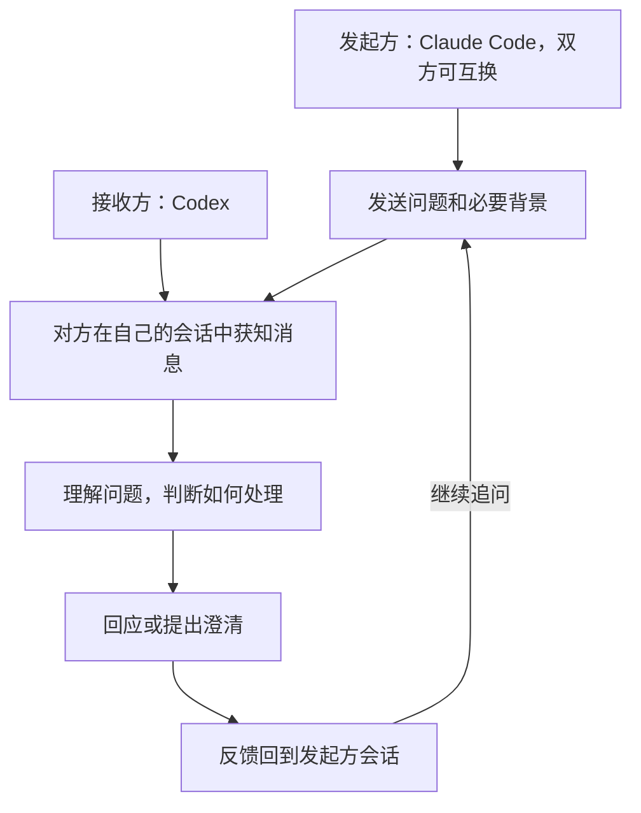

# 双向会话通信 Target Map

<small><em>T1，来源于 <a href="DesignMap.md">DesignMap</a> 的圈定。Target 与本轮成功标准已由 PO 确认，当前进入 HMW 讨论；方案、原型和测试的具体内容待后续确定。研究背景见 <a href="deep-research/Synthesis.md">综合结论</a>，当前研究基线为 design-sprint 的 6ff3397，综合结论含 f016111 的补记。</em></small>

## 1. Target Goal 与 Questions

### target goal

使 Codex 与 Claude Code 的两个现有会话能够主动双向发送消息、接收回复并继续对话，基础通信无需 PO 代为搬运消息。

<small><em>重点对象是发起沟通的一方，本轮以 Claude Code 的 Developer 会话向 Codex 的 Scrum Master 会话提问作为代表，双方均可主动发起。圈定从发送问题到回复返回，包含必要的追问往返。PO 希望先验证基础通信，再由 Scrum 实现骨架，后续功能按需要通过新的工作项与 PR 迭代。</em></small>

本轮成功标准：通过通信测试，证明消息按已确认的接收规则进入对方现有会话，并能够连续往返。

<small><em>空闲时，收到消息触发新的模型调用；工作中，消息先排队，在当前模型调用及其工具执行结束后、下一次模型调用前进入上下文。接收方自行判断如何处理消息。两个方向均适用；反馈质量、完整开发任务交付和长期减负效果不作为本轮验收门槛。</em></small>

### questions

| 来源 | 本轮选定的问题 |
|---|---|
| DesignMap Q1 | 两个方向能否向对方现有会话送达消息，并满足空闲时触发调用、工作中按约定时机进入上下文的接收规则？ |
| DesignMap Q3 的通信部分 | 请求、回复、追问和再次回复能否在同一对现有会话中连续往返？ |

<small><em>Q3 的完整问题还涉及结论与分歧的掌握，本轮只验证其中的通信连续性。Q2、Q4、Q5 保留为观察项。本轮聚焦一对已运行会话；共同讨论现场、更大规模会话协作和退出后恢复等扩展不列入本次圈定。</em></small>

## 2. Target Map 与 HMW

### map

<small><em>此图对应 DesignMap 中的 B、C、D、F、G 五个步骤。原型验证重点是消息与回复能否进入正确的现有会话，并接续对话。具体传输方式由方案探索决定。</em></small>

### HMW

<small><em>设计出发点：双方在独立会话中各自工作，接收新消息时的状态可能不同；一次交流还需要回复和追问能继续往返。PO 希望省去其中的人工转述。以下两条 HMW 从这些已知需求提炼，供接下来讨论与方案发散。</em></small>

**HMW-1：我们如何让新消息适应接收方的工作节奏，在忙碌或空闲时都能被它获知？**

<small><em>对应 Map 的 C、G 及 Q1。关键困难是消息到达时，对方可能处于不同工作状态。空闲时触发调用、工作中在约定的调用边界接收，是已确认的设计约束；此问题打开的是如何让消息与这些状态衔接的方案空间。</em></small>

**HMW-2：我们如何让回复和追问接回原来的对话，使双方在各自会话中持续交流？**

<small><em>对应 Map 的 B、F、G 及 Q3 的通信部分。双方上下文独立，单条消息送达后仍需要接续往返。设计机会在于让回应找到对应的发起方、让下一次发言接上这次交流，从而省去 PO 再次转述。</em></small>

<small><em>HMW 保留多种实现路径，具体方案由后续探索产生。从 HMW 展开起，方案与原型探索、测试设计两条工作线并行推进；各自内容经讨论后再记录。</em></small>

## 3. 方案、原型与验证

待后续补充记录。
