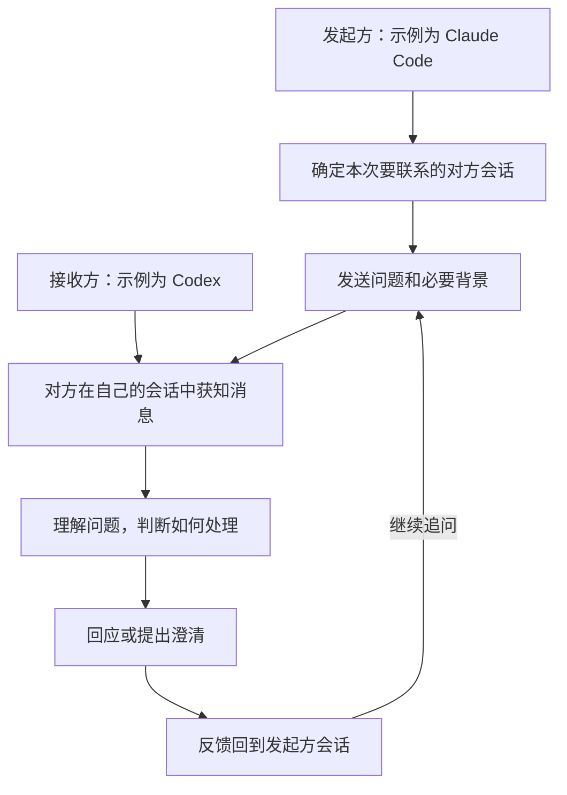

# 双向会话通信 Target Map

<small><em>T1，来源于 <a href="../DesignMap.md">DesignMap</a> 的圈定。Target 与基础通信目标已由 PO 确认；前两节已结合 Designer 审阅修订，三条 HMW 保留。方案、原型和测试的具体内容待后续讨论，第三节保持空白。背景见 <a href="../deep-research/Synthesis.md">综合结论</a> 与 <a href="../deep-research/Research.md">修订版研究报告</a>；研究基线为 design-sprint 的 6ff3397，综合结论含 f016111 的补记。</em></small>

## 1. Target Goal 与 Questions

### target goal

使 Codex 与 Claude Code 的两个现有会话能够主动双向发送消息、接收回复并继续对话，基础通信无需 PO 代为搬运消息。

<small><em>重点对象是需要向另一会话发起交流的一方，本轮以 Claude Code 的 Developer 会话向 Codex 的 Scrum Master 会话提问作为代表，双方均可主动发起。关键体验是发出消息后在原会话收到回应并继续交流；其中包含首次联系时找到正确的对方会话。PO 希望先把基础通信做通，后续功能按需要通过新的工作项与 PR 迭代。</em></small>

本轮成功标准：通过通信测试，证明消息按已确认的接收规则进入对方现有会话，并能够连续往返。

<small><em>空闲时，收到消息触发新的模型调用；工作中，消息先排队，在当前模型调用及其工具执行结束后、下一次模型调用前进入上下文。接收方自行判断如何处理消息。两个方向均适用；反馈质量、完整开发任务交付和长期减负效果不作为本轮验收门槛。</em></small>

<small><em>“现有会话”指本次通信选定、发送时已运行的那两个原会话；消息接收和对话往返须发生在它们的工作上下文中。仅由分叉副本或替代会话收信、应答不算达标。此处约束的是实际参与交流的会话，具体投递机制尚未选择。</em></small>

### questions

| 来源 | 本轮选定的问题 |
|---|---|
| DesignMap Q1：会话识别 | 发起方能否找到并准确指定本次要联系的对方现有会话？ |
| DesignMap Q1：送达与接收 | 两个方向能否向对方现有会话送达消息，并满足空闲时触发调用、工作中按约定时机进入上下文的接收规则？ |
| DesignMap Q3 的通信部分 | 请求、回复、追问和再次回复能否在同一对现有会话中连续往返？ |

<small><em>会话识别是 PO 在讨论中指出的发送前提，归入 Q1，具体识别方式尚未选择。Q3 的完整问题还涉及结论与分歧的掌握，本轮只验证其中的通信连续性。Q2、Q4、Q5 保留为观察项。本轮聚焦一对已运行会话；共同讨论现场、更大规模会话协作和退出后恢复等扩展不列入本次圈定。</em></small>

<small><em>审阅还提出送达状态反馈、接收失败处理、会话重启或改名后的寻址维护、消息来源校验等问题，其本轮范围尚待讨论，未统一列为排除项。产品是否提供送达状态反馈，与测试能否取得实际收信证据，是两个不同问题。</em></small>

## 2. Target Map 与 HMW

### map

起点：发起方准备就一个问题联系另一方。

结束状态：回应回到发起方原有会话，双方能够继续这次交流，PO 无需代为搬运消息。

<small><em>此图共六个步骤，将 DesignMap 的 B“向对方发送问题和必要背景”展开为 B1 会话识别和 B2 发送，保留 C、D、F、G。双方角色可互换，回复遵循同样的接收规则；PO 可在任一会话参与，本图聚焦消息往返。接收方自行判断何时回应，图中展示需要回应的一条完整路径。D 保留交流中的理解与处理环节，其质量对应 Q2、Q4，本轮为观察项，不另设 HMW。</em></small>

### HMW

<small><em>设计出发点来自 PO 的实际协作需要：目前由 PO 在两个独立会话之间转述，希望双方能直接交流。首次联系需要知道对方是谁；消息到达时，对方可能忙碌或空闲；单次送达之后，还需要回复和追问能够接续。以下 HMW 分别打开这三个环节的方案空间；Designer 审阅建议全部保留，本轮不新增、合并或删除。</em></small>

**HMW-1：我们如何让发起方找到并准确指定本次要联系的对方会话？**

<small><em>对应 B1 与 Q1 的会话识别问题。知道对方使用哪种工具或承担什么角色，还需要落实到本次要联系的具体会话。这一问题聚焦首次联系怎样建立准确的对象关系，保留不同的识别方式。</em></small>

**HMW-2：我们如何让新消息适应接收方的工作节奏，在忙碌或空闲时都能被它获知？**

<small><em>对应 C、G 与 Q1 的送达及接收问题。关键困难是两端的工作状态各自变化；消息需要进入对方实际参与工作的上下文。空闲时触发调用、工作中在约定的调用边界接收，是已确认的约束，如何实现这种衔接仍有待探索。</em></small>

**HMW-3：我们如何让回复和追问接回原来的交流，使双方在各自会话中继续对话？**

<small><em>对应 B2、F、G 与 Q3 的通信部分。双方上下文独立，一次送达还需要成为能够来回接续的交流。此问题聚焦回应如何返回原发起方，以及下一次发言如何接上正在讨论的问题，省去 PO 再次转述。</em></small>

<small><em>后续 Ideate 面向完整 Target，结合研究材料组合候选方案。方案与原型探索、测试设计从 HMW 展开起并行推进，具体内容经讨论后再记录。候选须让消息按约定进入指定原会话并在那里接续交流；底层可以采用文件等不同媒介存取或转递消息，是否符合目标以原会话的实际接收行为判断。</em></small>

## 3. 方案、原型与验证
