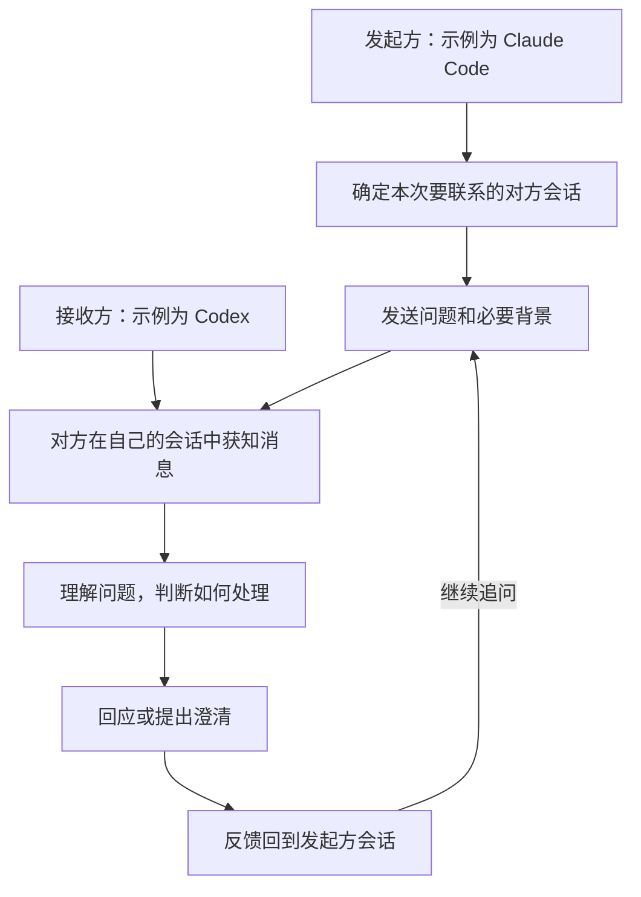

# 双向会话通信 Target Map

<small><em>T1，来源于 <a href="../DesignMap.md">DesignMap</a> 的圈定。Target 与基础通信目标已由 PO 确认；前两节已结合 Designer 审阅修订，三条 HMW 保留。第三节记录初始原型方案与制作进展；P01 已验证 Codex 空闲 queue 收信，P02 确认 queue 单独使用未满足工具后的接收边界，P03、P04 已验证同步 Hook 注入及外部文件来信的定向接收。P05 完成含 PO 批准的真实 Claude 往返；P06 已在新配对的原会话上完成双向工具边界收信、真实旧唤醒抑制与 Codex 生成末尾 Stop 接续。Claude 纯模型生成期间收信经五次采样判定为严格失败，当前原型不能宣布完整基础通信目标全部通过。背景见 <a href="../deep-research/Synthesis.md">综合结论</a> 与 <a href="../deep-research/Research.md">修订版研究报告</a>；研究基线为 design-sprint 的 6ff3397，综合结论含 f016111 的补记及原型实验更新。</em></small>

## 1. Target Goal 与 Questions

### target goal

使 Codex 与 Claude Code 的两个现有会话能够主动双向发送消息、接收回复并继续对话，基础通信无需 PO 代为搬运消息。

<small><em>重点对象是需要向另一会话发起交流的一方，本轮以 Claude Code 的 Developer 会话向 Codex 的 Scrum Master 会话提问作为代表，双方均可主动发起。关键体验是发出消息后在原会话收到回应并继续交流；其中包含首次联系时找到正确的对方会话。PO 希望先把基础通信做通，后续功能按需要通过新的工作项与 PR 迭代。</em></small>

本轮成功标准：通过通信测试，证明消息按已确认的接收规则进入对方现有会话，并能够连续往返。

<small><em>空闲时，收到消息触发新的模型调用；工作中，消息先排队，在当前模型调用及其工具执行结束后、下一次模型调用前进入上下文。接收方自行判断如何处理消息。两个方向均适用；反馈质量、完整开发任务交付和长期减负效果不作为本轮验收门槛。</em></small>

<small><em>“现有会话”指本次通信选定、发送时已运行的那两个原会话；消息接收和对话往返须发生在它们的工作上下文中。仅由分叉副本或替代会话收信、应答不算达标。此处约束的是实际参与交流的会话，原型投递机制见第三节，其实际行为尚待验证。</em></small>

### questions

| 来源 | 本轮选定的问题 |
|---|---|
| DesignMap Q1：会话识别 | 发起方能否找到并准确指定本次要联系的对方现有会话？ |
| DesignMap Q1：送达与接收 | 两个方向能否向对方现有会话送达消息，并满足空闲时触发调用、工作中按约定时机进入上下文的接收规则？ |
| DesignMap Q3 的通信部分 | 请求、回复、追问和再次回复能否在同一对现有会话中连续往返？ |

<small><em>会话识别是 PO 在讨论中指出的发送前提，归入 Q1，本轮原型采用第三节的显式配对方式。Q3 的完整问题还涉及结论与分歧的掌握，本轮只验证其中的通信连续性。Q2、Q4、Q5 保留为观察项。本轮聚焦一对已运行会话；共同讨论现场、更大规模会话协作和退出后恢复等扩展不列入本次圈定。</em></small>

<small><em>审阅还提出送达状态反馈、接收失败处理、会话重启或改名后的寻址维护、消息来源校验等问题。本轮原型的最低处理约定见第三节，更完整的能力留待后续取舍。产品是否提供送达状态反馈，与测试能否取得实际收信证据，是两个不同问题。</em></small>

## 2. Target Map 与 HMW

### map

起点：发起方准备就一个问题联系另一方。

结束状态：回应回到发起方原有会话，双方能够继续这次交流，PO 无需代为搬运消息。

<small><em>此图共六个步骤，将 DesignMap 的 B“向对方发送问题和必要背景”展开为 B1 会话识别和 B2 发送，保留 C、D、F、G。双方角色可互换，回复遵循同样的接收规则；PO 可在任一会话参与，本图聚焦消息往返。接收方自行判断何时回应，图中展示需要回应的一条完整路径。D 保留交流中的理解与处理环节，其质量对应 Q2、Q4，本轮为观察项，不另设 HMW。</em></small>

### HMW

<small><em>设计出发点来自 PO 的实际协作需要：目前由 PO 在两个独立会话之间转述，希望双方能直接交流。首次联系需要知道对方是谁；消息到达时，对方可能忙碌或空闲；单次送达之后，还需要回复和追问能够接续。以下 HMW 分别打开这三个环节的方案空间；Designer 审阅建议全部保留，本轮不新增、合并或删除。</em></small>

**HMW-1：我们如何让发起方找到并准确指定本次要联系的对方会话？**

<small><em>对应 B1 与 Q1 的会话识别问题。知道对方使用哪种工具或承担什么角色，还需要落实到本次要联系的具体会话。这一问题聚焦首次联系怎样建立准确的对象关系，保留不同的识别方式。</em></small>

**HMW-2：我们如何让新消息适应接收方的工作节奏，在忙碌或空闲时都能被它获知？**

<small><em>对应 C、G 与 Q1 的送达及接收问题。关键困难是两端的工作状态各自变化；消息需要进入对方实际参与工作的上下文。空闲时触发调用、工作中在约定的调用边界接收，是已确认的约束，如何实现这种衔接仍有待探索。</em></small>

**HMW-3：我们如何让回复和追问接回原来的交流，使双方在各自会话中继续对话？**

<small><em>对应 B2、F、G 与 Q3 的通信部分。双方上下文独立，一次送达还需要成为能够来回接续的交流。此问题聚焦回应如何返回原发起方，以及下一次发言如何接上正在讨论的问题，省去 PO 再次转述。</em></small>

<small><em>本轮 Ideate 面向完整 Target，结合研究材料组合候选方案，交付见 <a href="Ideation.md">Ideation</a>。方案与原型探索、测试设计并行推进；选定的初始原型方案记录在第三节。消息须按约定进入指定原会话并在那里接续交流；是否符合目标以原会话的实际接收行为判断。</em></small>

## 3. 方案、原型与验证

### 3.1 方案选择：最小原生双向通信桥

采用候选 A 的点对点形态，加入候选 B 中必要的会话配对与轻量收件箱。保留消息 ID 去重和错误记录，暂不引入候选 C 的完整台账、自动降级链及定时重试。

目标保持不变：双方原会话实际参与交流；空闲时被消息唤起，工作中在约定的调用边界获得正文，并能持续往返。

### 3.2 组成与行为

#### 一个本地桥接程序

组合原型使用已安装的 Node.js 24.14.0 和 PowerShell，以临时 JSON 文件保存消息、配对与消费记录，无需安装外部依赖。SQLite 等正式存储选择留到 Scrum。

入口为 `prototype/Bridge.mjs`，提供 `pair`、`send`、`reply`、`status` 操作。消息包含唯一 ID、发送会话、接收会话、所属交流、回复对象和正文；支持短文本或正文文件输入。

代码放在本目标目录的 `prototype/`。运行数据存放在用户临时目录，以支持不同 worktree 访问同一配对；令牌限制为当前操作系统用户可读，不进入 Git。

#### 显式配对两个原会话

原型阶段显式指定 Codex 线程 ID 和已核对的 Claude 端点文件，通过 `pair` 固定这两个对象。发送与回复时，根据调用工具继承的会话 ID 检查是否属于当前配对；自动发现和 `SessionStart` 登记暂不制作。

配对之后按精确标识投递，其他会话启动不能覆盖当前配对。首版不自动选择“最新会话”或替换已有配对。

#### Claude → Codex

消息正文先写入收件箱，再通过 `codex queue` 投递带消息 ID 的唤醒信号。

Codex 使用同步 Hook 补足正文交付：

- `UserPromptSubmit`：在空闲会话被唤起时，将待收正文加入本次调用上下文。
- `PostToolUse`：在工具结束后，将待收正文加入下一次调用上下文。
- `Stop`：处理最后一次生成期间到达、尚未经过工具后接收点的消息。

上述入口共用消费记录；文件以原子移动领取，避免多个入口重复领取同一正文。已领取消息的残留唤醒信号由 `UserPromptSubmit` 返回 block 抑制；是否能在真实 queue 中正常清理该信号、并继续接收后续消息，仍是组合验证的必查项。本地逻辑检查不代替此项实测。

本版限定短文本，每条最多 2000 字符，Codex 同时只允许一条尚未领取的消息。发送方不需要自行判断接收方状态；已有待收消息时明确报错，不覆盖，也不自动重试。

#### Codex → Claude

统一采用 Claude 原生命名管道，使用目标会话令牌认证并投递完整正文。首先验证它在空闲、生成中、工具执行中三种状态下的行为。

不依赖 `agents --json` 预判状态，不在首版中加入 `-p` 中继或自动切换通道。未满足接收要求时，记录失败并重新检视该适配器。

#### 回复与最小错误处理

接收方通过 `reply` 使用原消息的会话与交流信息返回正文。消息明确标记为协作方内容，接收方仍按自身规则决定如何处理。

发送失败明确返回错误；“已提交”不宣称“已读”。首版不提供产品级已读回执，也不自动重试。人工中断或会话失效时进入明确的暂停状态，由操作者恢复后再测试。

### 3.3 制作顺序

1. **先做适配探针。** 核实 queue 对现有 Codex 会话的空闲唤起、相关 Hook 是否触发及正文落点、重复唤醒的处理，以及 Claude 管道的三种接收状态。任何关键条件不成立，就停止当前组合并提交证据。
2. **再接完整往返。** 实现显式配对、消息信封、收件箱、回复操作和最小错误记录；正文直接进入上下文，避免增加“先看通知、再调用工具取正文”的额外一轮。
3. **运行既有测试方案。** 按 <a href="test/TestPlan.md">TestPlan</a> 完成 T01–T05 的两个方向，结果记录到 `test/TestResults.md`。补齐具体操作、取证方式和观察窗口，并修正测试文档移动造成的相对链接。

### 3.4 验证与默认条件

- 原型限定为同一 Windows 用户下的一对已运行会话，使用短文本交流；首先沿用已核对的 Codex 0.153.4、Claude Code 2.1.263。
- 保持双方现有全局权限设置。项目 Hook 按工具要求完成信任配置；不为接通消息而普遍放开入站权限。
- 接收时机以实际调用与工具事件证明；最终回复或源码分析不能单独证明通过。
- 原型只是验证这套组合的载具。全部要求获得充分证据后，再作为 Scrum 实现骨架的依据。

<small><em>技术依据：<a href="https://learn.chatgpt.com/docs/hooks">Codex Hooks 官方文档</a>、<a href="https://code.claude.com/docs/en/cross-session-messaging">Claude 跨会话消息官方文档</a>，以及 Designer 的 Ideation 交付。本节描述待验证的方案；实际实验状态见下方制作记录。</em></small>

### 3.5 制作记录

PO 确认原型可以简化中间环节，逐步制作、逐步解释。首步 P01 手动指定当前 Codex 原会话，由普通脚本暂代 Claude，通过 queue 投递完整短消息，单独验证空闲唤起；暂不制作自动配对、收件箱和 Hook。此简化只用于通道实验，最终仍按既有接收规则验证两个真实会话的双向往返。

2026-09-06，PO 执行 <a href="prototype/README.md">P01 操作及探针</a> 后，当前 Codex 原会话由空闲状态启动新回合，获得完整消息并回复正确标记；投递记录与会话事件已核对，P01 通过。此结果只覆盖当前环境的 Codex 空闲接收，忙碌接收与 Claude 方向仍待验证；实际时序及证据集中记录于 <a href="test/TestResults.md">TestResults</a>。

2026-09-06，P02 已执行：queue 在工具运行期间成功接受消息，但工具后的首次续接未收到正文；原工作回合结束后，同一会话才开启新回合接收。queue 单独使用未满足忙碌接收要求。下一步验证同步 `PostToolUse` Hook 的正文注入及其与 queue 的配合；P02 当次未安装 Hook，组合方案仍待实测。详见 TestResults 的 P02 记录。

P03 由 Hook 在工具结束时生成一条随机消息，单独检查 `additionalContext` 能否进入首次续接。早期两次现场测试及一次诊断复测缺少 Hook 执行证据，保留为无法判定；重新加载配置后，正文在工具后的首次续接前进入上下文，检查点出现正确标记，原工作回合继续完成，P03 通过。恢复只是实验准备，标记在恢复后的工具执行结束时才生成。下一步将合成正文换成外部脚本发来的正文，再检验与 queue 的配合；单项通过不等于整个组合已验证。操作及证据见 prototype/README 与 TestResults。

P04 使用外部脚本在指定工具窗口内把正文发布到一个临时 JSON 文件，Hook 在工具完成后按会话与窗口读取，并将正文加入上下文。首轮因使用 P02 queue 模式而混测，保留为无法判定；修正后于 2026-09-07 重跑通过，完整正文在工具后的首次续接前进入原会话。原型继续使用手动寻址与少量脚本，数据库、自动登记或完整命令接口留到 Scrum 再决定。本步没有同时使用 queue，完整组合仍待验证。

P05 已按 PO 指定选定 Designer 会话 `de6f62ab-7c48-4787-8d2a-73944478e05e`，于 2026-09-07 完成首次真实往返。Claude 最初因发送方未声明权限模式而暂存消息，PO 批准后，原 Designer 会话收到并通过 queue 回信，原 Codex 会话收到并确认。结果为经一次人工接收批准的往返成功，尚未证明无需逐条批准的自动接收。PO 随后决定暂时保留现有接收审批，是否调整 Claude 设置以后再决定；本轮不制作自动批准机制，修改设置不作为继续原型的前置项。接下来组合 Codex 收信入口，完成连续对话，并在同一原型中演练双方接收状态；审批作为实验条件单独记录，证据与适用范围见 TestResults。

组合原型初版已写入 `Bridge.mjs`、`BridgeStore.mjs` 与 `BridgeQueue.ps1`，复用已有 Claude 管道适配器。9 项组合逻辑检查与 3 项管道检查通过，新增三个 Hook 已受信任并开始现场运行。已在固定原会话间完成请求、回复、追问和再次回复；另重放了已消费的旧唤醒，确认抑制后队列仍能推进到普通控制提示。该重放不代替真实工作中发送的竞争情形，组合 PostToolUse 收信、Stop 接续和其他接收状态仍需验证。操作见 <a href="prototype/Bridge.md">组合原型说明</a>，具体证据与范围见 TestResults。

PO 随后自行将 Claude 的 crossSessionInbound 设为 accept 并要求继续，后续实验按该配置观察实际接收，历史人工批准记录保留。准备了只用于演练的时间窗口脚本，让真实 Claude 会话先等待、再向工作中的 Codex 发信，并观察反向工具中收信及 Stop 接续；协议和消息仍由同一组合原型处理，不扩展为正式产品功能。

原 Designer 会话因 `sdisk.cc` 返回 503/502 以及 Claude daemon 回收后台 worker 而断开；该外部障碍已记录。PO 显式选择新 Designer 原会话 `85ca6832-0f48-4dd1-8bb6-c1a635df63d4` 重配对，旧配对数据保留，活动 bridge 目录用指针切换。2026-09-07 的 `codex-tools` 运行 `e087acc9-...` 已通过双向工具边界收信：Claude 在 Codex 工具窗口内发信，PostToolUse 将全文交给首次续接；Codex 反向正文在 Designer 后台任务尚未结束时进入原会话，并在下一次续接报告正确标记；真实旧唤醒被抑制且队列清空。随后 `codex-stop` 运行 `71908b9f-...` 通过：消息在 Codex 最后一次生成期间发布，Stop 将全文交给紧接着的续接，旧唤醒被抑制且未形成循环。Claude 纯模型生成期间的五次 explicit 采样随后判定该格失败：第四次中消息于原总结生成中到达，接收队列与原生成截断事件毫秒级重合，下一次上下文虽获得正文，但当前调用没有正常完成。PO 随后要求复测；第五次运行去除预告文本后仍复现，正文在消息到达点停在半句。该结果不覆盖已通过的工具边界与空闲路径，也说明两侧适配不能简单对称复用。
