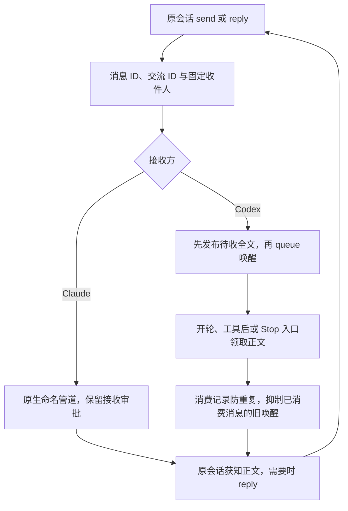

# 组合原型

状态：主体已组装，9 项组合逻辑检查与 3 项管道检查通过；已完成统一接口连续对话、已消费唤醒重放抑制，以及双向工具边界收信。Stop 接续等生成末尾状态仍待验证。PO 已自行将 Claude 的 crossSessionInbound 改为 accept，后续实验按该配置观察实际接收。

## 固定配对

当前活动配对：

- Codex 原线程：`01a074a1-bf49-72f2-9337-194555aa49f6`。
- Designer 原会话：`85ca6832-0f48-4dd1-8bb6-c1a635df63d4`，会话名为 `ClaudeToCodex # [designer]-[design-sprint]-[target测试]`。
- 配对 ID：`0b05be67-e886-4809-83b3-f94921abac3c`。
- 活动数据目录：`%TEMP%/cross-session-agent-messaging/bridge-85ca6832-0f48-4dd1-8bb6-c1a635df63d4/`。

旧配对 `7c1808fd-50d4-4726-b1d7-430dd49e63af` 指向已停止的 `de6f62ab-...` 会话；其 `bridge/` 数据保留，不与新运行混用。会话重启后的寻址维护仍是开放问题，本原型的活动目录指针只是保留证据的显式重配对方式，不是自动恢复机制。

两边都通过 [Bridge.mjs](Bridge.mjs) 使用 `send`、`reply`，不再自行选择 queue 或文件通道。调用者根据自身工具环境中的 `CODEX_THREAD_ID` 或 `CLAUDE_CODE_SESSION_ID` 识别，必须是当前配对中的两个原会话之一。



## 启用

1. 在 Codex `/hooks` 中审阅并信任三条指向 `Bridge.mjs hook` 的新增定义：`PostToolUse`、`UserPromptSubmit`、`Stop`。原 `PostToolProbe.mjs` 定义保持受信任。
2. 按 P03 的加载经验，正常退出 CLI，再恢复同一线程。恢复只是加载配置，不计为收信成功；当前组合收件箱为空。
3. 回到对话后开始组合验证。Claude 端审批照旧，不修改其接收或工具权限设置。

```powershell
codex resume 01a074a1-bf49-72f2-9337-194555aa49f6
```

新增定义的审阅要求来自 [Codex 官方 Hook 规则](https://learn.chatgpt.com/docs/hooks#review-and-trust-hooks)。官方 `hooks/list` 已识别配置且无错误；本次开始现场验证前，已核对三条新增定义的信任哈希与当前定义一致。

## 使用

以下 `send`、`reply` 由原会话通过各自工具调用。短文本可以使用 `--body`，换行和引号较多时使用 `--body-file`，每条最多 2000 字符。

```powershell
node "D:\ClaudeToCodex\IDEO\cross-session-agent-messaging\prototype\Bridge.mjs" send --body "这轮原型还缺哪个关键验证？"
node "D:\ClaudeToCodex\IDEO\cross-session-agent-messaging\prototype\Bridge.mjs" reply --to '<收到的消息 UUID>' --body-file '<UTF-8 回信正文文件>'
node "D:\ClaudeToCodex\IDEO\cross-session-agent-messaging\prototype\Bridge.mjs" status
```

接收内容附带实际消息 ID、交流 ID 和回复命令。`reply` 保留交流 ID，引用原消息并返回原发起会话；内容和回应时机由接收方决定，不自动生成 ACK。

配对已准备。重跑同一配对命令不会替换对象；不同配对会报错，不选择“最新会话”。

```powershell
node "D:\ClaudeToCodex\IDEO\cross-session-agent-messaging\prototype\Bridge.mjs" pair --codex '01a074a1-bf49-72f2-9337-194555aa49f6' --claude-endpoint "$env:TEMP\cross-session-agent-messaging\claude-de6f62ab-7c48-4787-8d2a-73944478e05e.json"
```

## 数据与限制

运行数据位于 `%TEMP%/cross-session-agent-messaging/bridge/`。`pair.json` 保存精确会话 ID 和加密端点文件位置；`messages/` 保存消息，`pending/` 保存 Codex 的单条待收消息，`claims/` 保留领取正文，`receipts/` 与 `events.jsonl` 记录消费和发送状态。`CTC_BRIDGE_DIR` 用于隔离本地检查。

Codex 同时只允许一条尚未领取的消息。已有待收消息时发送报错，不覆盖正文；发送失败也不自动重试，因为正文可能已发布或领取。`wake-submitted`、`pipe-written`、`context-prepared` 均不宣称模型已读，实际收信仍通过会话事件验证。

工作中已领取的消息，其旧 `[CTC-WAKE ...]` 到达时由 `UserPromptSubmit` 返回 block 抑制。只处理已知、已消费的原型信号，普通用户提示不因此被阻断。Stop 只在有新待收消息时要求继续；没有新消息就直接放行。

## 接下来的验证

已单独重放一条消费过的 queue 唤醒：抑制事件、无重复正文、队列项移出和后续控制提示进入均有现场证据。随后 `codex-tools` 运行 `e087acc9-...` 完成双向工具边界收信：Claude 在 Codex 工具窗口内发信，PostToolUse 将全文交给首次续接；Codex 的反向消息在 Designer 后台任务尚未结束时进入原会话，并在下一次续接报告正确标记。真实旧唤醒也被抑制且队列清空。Stop 的正文是否进入紧接着的模型续接仍未验证；若实际行为不支持，记录证据并调整，不把本地 JSON 输出检查当作现场通过。

随后用同一原型完成请求、回复、依赖前文的追问和再次回复，并让双方轮流处于空闲、生成中和工具执行中。沿用 Claude 审批，分别记录到达、放行与进入上下文。正式实现、更多并发、自动发现和更完善的恢复留到 Scrum。

```powershell
node --test IDEO/cross-session-agent-messaging/test/Bridge.test.mjs
node --test IDEO/cross-session-agent-messaging/test/ClaudePipeProbe.test.mjs
```

当前分别 9 项与 3 项通过，现场结果记录到 [TestResults](../test/TestResults.md)。

## 工作窗口演练

[RunBridgeScenario.mjs](../test/RunBridgeScenario.mjs) 只负责安排实验时间，不替代通信桥。所有准备通知、测试正文和完成通知仍由两个原会话通过 Bridge 的 send/reply 发送，接收方的工作工具只输出时间与运行编号，不读取来信正文。

`codex-tools` 场景：Designer 在原会话前台工具中执行 arm，先回复准备好，再等待 Codex 的 20 秒工具窗口；窗口开始后发送新正文。Codex 的首次续接先报告实际收到的标记，再通过 reverse 向仍在工具中等待的 Claude 回信，执行短动作并结束。原 Claude 工具观察旧唤醒被抑制后发出完成通知并退出；Claude 应在工具后的首次续接报告反向消息标记。由此观察两个方向的工具中到信，以及真实发送产生的旧唤醒处理。

`codex-stop` 场景：同样先准备发送方，Codex 用一个短工具发布生成阶段信号后不再调用工具，给出一段最终输出；Claude 工具延迟 5 秒发信。若时机捕捉成功，正文应由 Stop 放入紧接着的续接；实际仍以接收记录与模型调用时序为准。若记录显示由 UserPromptSubmit 接收，不能算 Stop 场景通过。

每次运行使用独立 UUID，准备和工作步骤均为一次性，等待最多 5 分钟。脚本执行失败、时机未捕捉到或证据不足，均需明确记录，不能因完成通知出现就判通过。运行文件位于组合目录的 scenarios/<运行 UUID>/，检查点前不读取 sent.json、reverse.json 或消息记录。
