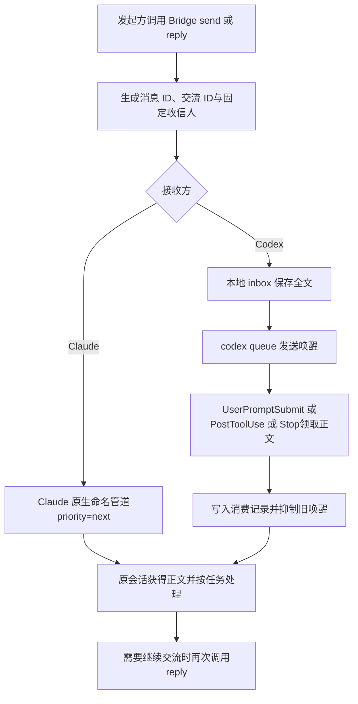

# Cross-Session Agent Messaging

- Target：让 Codex 与 Claude Code 的两个现有会话主动双向发送消息、接收回复并继续对话。
- 状态：T01–T05 双方向已在记录的原型环境中通过，Design Sprint 收口。
- 交接方向：由 Scrum 实现可安装、可配置、可回归验证的产品骨架。
- 详细原始证据：design-sprint 分支历史中的 `IDEO/cross-session-agent-messaging/`；收口 tag 见 `design-sprint-closed`。

## 1. Target Goal 与验收

目标不是复制一个共同聊天室，而是让两个独立原会话能够完成一次工作交流：找到对方、发送问题和必要背景、在接收方原会话获知、理解并回应，然后让回应回到发起方原会话，继续追问和协作。

「现有会话」指发送时已选定且正在运行的原会话实例。分叉副本、替代会话或一次性中继代答不能作为验收通过。

| 场景 | 通过判据 |
|---|---|
| T01 首次联系 | 能准确指定对方原会话，正文到达并返回回应 |
| T02 空闲收信 | 消息触发接收方原会话的新模型调用 |
| T03 模型生成期间收信 | 当前生成完整结束，消息在下一次上下文进入 |
| T04 工具边界收信 | 当前工具完整结束，消息在随后首次续接前进入 |
| T05 连续往返 | 请求、回复、追问、再答均发生在同一对原会话之间 |

反馈质量、完整开发任务交付和 PO 长期减负效果保留为观察项，不阻塞本目标。

## 2. 选定方案



### Claude → Codex

发送方先把完整消息写入本地 pending inbox，再通过 `codex queue` 唤醒指定 Codex 原线程。Codex 侧 hook 在合适的上下文边界读取正文：

- `UserPromptSubmit`：空闲唤醒或新上下文入口。
- `PostToolUse`：当前工具结束后、下一次模型调用前。
- `Stop`：当前生成结束后的紧接续接。

消费记录用于防止同一条消息重复注入；已经消费过的旧 `[CTC-WAKE ...]` 信号会被抑制，且不阻塞后续普通控制提示。

### Codex → Claude

发送方使用 Claude 原生命名管道，按选定会话的端点与令牌投递。普通消息固定 `priority=next`：当前流式输出完整结束后，消息在下一个上下文机会进入。`now` 是显式抢占模式，会中断或截断当前输出，只用于专门测试或未来明确的紧急路径；`later` 表示排在已有等待消息之后，本轮未现场实测。

## 3. 验证结果

| 场景 | Claude → Codex | Codex → Claude |
|---|---|---|
| T01 首次联系 | 通过：固定配对与身份核对 | 通过：选定 Designer 原会话收到并回应 |
| T02 空闲收信 | 通过：queue 唤醒原 Codex 会话 | 通过：accept 配置下触发原会话续接 |
| T03 生成中收信 | 通过：Stop 交付生成末尾消息 | 通过：`priority=next` 保持当前输出完整 |
| T04 工具边界收信 | 通过：PostToolUse 在工具后交付 | 通过：管道在后台任务边界进入原会话 |
| T05 连续往返 | 通过：请求、回复、追问、再答 | 通过：同一运行覆盖双方向连续对话 |

关键修正：早期 T03 Codex→Claude 失败来自误用 `priority=now`，而不是原生管道无法满足边界。修正为 `next` 后，运行 `d93b861e-5703-4cab-b196-71ad1c4feaa0` 通过。

自动化检查曾在原型收口时通过：

```powershell
node --test IDEO/cross-session-agent-messaging/test/Bridge.test.mjs
node --test IDEO/cross-session-agent-messaging/test/ClaudePipeProbe.test.mjs
node --check IDEO/cross-session-agent-messaging/test/RunBridgeScenario.mjs
node --check IDEO/cross-session-agent-messaging/prototype/Bridge.mjs
node --check IDEO/cross-session-agent-messaging/prototype/BridgeStore.mjs
```

上述路径会随 IDEO 过程目录一起退出活动工作区；Scrum 应在新产品结构中重建等价测试，而不是依赖历史路径。

## 4. 范围限制与移交

通过结论限于同一 Windows 用户、单对已运行原会话、短文本、串行投递和记录的工具版本。以下能力未验证，不能在产品说明中暗示已完成：

- 会话重启、daemon 回收或端点失效后的自动恢复。
- 并发消息、长文本和重复投递的全部组合。
- 持久台账、送达回执、失败重试和事务性投递。
- 来源防伪、令牌生命周期与多用户安全。
- 共同讨论现场、多会话协作和远程协作。

Scrum 首个骨架的建议目标：把已验证路径产品化为可重复安装和配置的 CLI，保留 `priority=next` 作为普通消息默认行为，用自动化回归覆盖消息帧、优先级、身份校验和 hook 交付，并提供一条可重复的端到端 smoke scenario。
