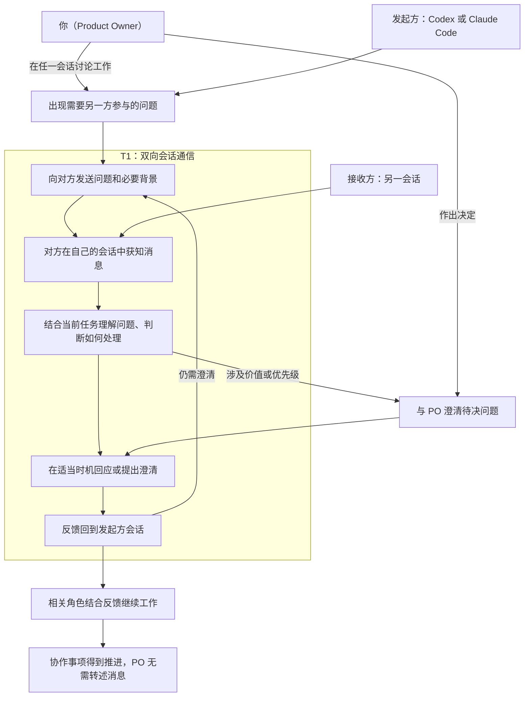

# Product Backlog

## 1. Product、Product Vision、Product Goal 与 DoD

### product

本产品是一个运行在本机环境中的 Codex 与 Claude Code 双向会话通信桥，让两个独立现有会话能够主动发送工作消息、接收回复并继续对话，使 PO 无需代为搬运消息。

<small><em>产品当前以已验证的最小原生双向桥为骨架：Claude→Codex 使用本地待收消息、queue 唤醒与 Hook 交付；Codex→Claude 使用原生命名管道并固定普通消息 `priority=next`。设计证据见 [Cross-Session Agent Messaging](../docs/ideo-design/cross-session-agent-messaging.md)。</em></small>

### Product Vision 与 Product Goal

**Product Vision**

让你、Codex 和 Claude Code 形成一个分工清楚、沟通顺畅的协作团队，能够共同澄清问题、讨论计划、参与评审，并将讨论结果落实为行动，持续推进项目、交付你认可的成果。

<small><em>你决定价值方向与优先级；Codex 通常承担 Scrum Master，Claude Code 通常承担 Developer 或其他角色。你可以在任一会话参与讨论，由该会话向另一方发送需要澄清的问题和背景，再将收到的意见用于继续讨论。</em></small>

**Product Goal**

让 PO 在实际项目中，通过 Codex 与 Claude Code 两个原始会话的直接交流，完成需求澄清和评审协作，将双方反馈用于推进决定或行动，无需人工转述跨会话消息。

首批用户为 PO 本人，产品成效以其真实使用体验检视。

### DoD

#### Definition of Outcome Done

PO 在真实使用场景中亲身体验产品，确认当前 Product Goal 所约定的价值已经实现，并记录体验场景与结论。

#### Definition of Output Done

Increment 已集成到产品中，可通过标准产品入口使用，通过与其声明范围相适应的质量验证，并由 PO 按事先约定的验收标准验收通过。

PO 验收是本团队的完成标准，可在 Sprint 内进行。技术质量验证与 PO 验收均须通过；验收中新发现的需求进入 Product Backlog，不自动改写已约定的完成标准。

## 2. Product Backlog Items

本节只保留未完成事项。编号用于追溯，不表示优先级；以下条目围绕已由 PO 确认的 1.0.0 发布方向精化，最终排序由 PO 决定，工作量和实现方式由 Developer 评估。各项验收标准写在备注中，并须同时满足 Definition of Output Done；尚待明确的范围继续精化。

| 编号 | 标题 | 用户故事 | 架构定位 | 当前状态 | 备注 |
|---|---|---|---|---|---|
| PBI-02 | 发布使用说明与故障排查 | 作为首批用户，我要仅凭随版本提供的说明完成安装、配置和故障处理，以便在实际项目中使用产品。 | 文档覆盖发布物的使用路径、两个实测故障、身份边界与运行环境；与安装和维护能力保持一致。 | 待 Developer 评估 | 延续 Sprint 01 Review 的文档修正。验收：随版本提供的说明覆盖获取、前置条件、安装、项目配置、首次通信、维护与卸载，命令与发布物一致；可据此识别双侧数据目录不一致及 Claude 端点失效，保留旧数据并完成显式重配对；澄清身份环境变量用于路由匹配，区分 Node 最低前置与已验证版本，声明工具版本和能力限制，修正已失效的 Sprint Backlog 引用。 |
| PBI-03 | 投递失败状态透明化 | 作为首批用户，我要看清消息的尝试投递、通道报错、待领取及有证据的领取状态，以免被本地记录误导。 | 改进 send-error、status 与消息记录的可解释性；证据不足时明确未知，领取不等于原会话已收到；不引入自动重试或送达回执。 | 待 Developer 评估 | 来自 Sprint 01 最终检视；是否纳入首版由 PO 排序决定。验收：标准状态入口可对照消息与事件，解释已发生的失败场景及已有的待领取或领取证据，证据不足时明确未知；`submitted:true`、通道写入及领取记录不被表述为原会话已收到，送达仍按接收方原始会话事件与唯一标记判定；报错但消息可能已发布或领取时，不诱导直接重发。 |
| PBI-05 | 1.0.0 版本发布与分发 | 作为首批用户，我要取得有明确版本的正式发布物，以便保存、再次获取并安装同一版本产品。 | 建立独立于开发工作区的分发产物与版本说明；发布渠道和包格式待确定。 | 待精化 | 验收：PO 可从约定位置取得标识为 `1.0.0` 的完整发布物和版本说明，安装使用不依赖开发工作区；说明明确分发内容、前置条件、支持范围及限制，渠道、可见范围和分发许可与首批使用方式一致。正式发布前，PO 使用最终分发的同一份发布物，在无现成 bridge 配置的新环境或项目中按说明安装、配对，完成双向请求、回复、追问与再答并验收通过；体验中反馈用于推进真实协作事项，PO 无需转述业务消息，记录版本、环境、问题与体验结论。 |
| PBI-06 | 从发布物安装并启用通信 | 作为首批用户，我要把取得的发布物安装到自己的实际项目中，以便无需开发工作区的现成配置即可开始跨会话协作。 | 明确安装位置、目标项目配置、前置依赖及首次启用路径，沿用已验证的双向通信能力与信任要求。 | 待 Developer 评估 | 为 PBI-05 提供安装能力。验收：PO 在声明支持的 Windows 环境中可按说明确定安装位置与目标项目，完成安装、必要信任、端点登记和配对；产品入口、hook 及回复指引指向实际安装位置，保留其他工具配置；两个选定原始会话完成真实双向通信，接收证据符合原始会话事件与唯一标记规则。 |
| PBI-07 | 安装维护与卸载 | 作为首批用户，我要能够重复安装、按说明升级及卸载产品，以便维护自己的安装并保留需要的数据。 | 定义安装生命周期、产品配置与用户数据的处理边界；后续版本兼容范围随版本声明。 | 待精化 | 验收：同版本重复安装不累积注册、不破坏其他工具配置，之后仍可通信；卸载移除产品集成配置与安装内容，保留其他工具配置，明确用户数据保留或清理方式且不静默丢失历史证据；升级约定说明版本替换、配置、配对和数据的处理，支持及验证场景经 Developer 评估后与 PO 明确，未验证的跨版本兼容性不作承诺。 |

## 3. 产品架构与已交付能力

### 协作地图

参与者：你（Product Owner）、Codex、Claude Code。图中按本次消息的方向将 Codex 与 Claude Code 分为发起方和接收方，两者可以互换。

起点：一方在项目工作中遇到需要另一方参与的问题；这也可以来自你与该方的讨论。

结束状态：反馈回到发起方会话并用于推进协作事项，你无需代为搬运消息。

<small><em>此图来自 Design Sprint 的协作地图，保留为 Product Backlog 的价值流背景。PO 可在任一会话参与；涉及价值或优先级时，由相关会话向 PO 澄清。接收方自行决定如何处理及何时回应。</em></small>

<small><em>“获知消息”和“反馈回到会话”均遵循已确认的接收规则：空闲时，消息触发新的模型调用；工作中，消息先排队，在当前模型调用及其工具执行结束后、下一次模型调用前进入上下文，此时原任务可以尚未完成。</em></small>

<small><em>检视位置：双方获知消息对应通信可靠性；提供背景与理解问题对应消息质量；回应和追问对应连续对话；判断处理及接续工作对应协作行动；PO 的实际参与负担对应产品价值。</em></small>

### 已交付能力

- PBI-01（Sprint 01）：已交付 Windows 本机、单对原始会话、短文本串行双向通信桥，可通过标准 CLI 入口安装、配置、发送与回复。Claude→Codex 使用本地待收消息、queue 唤醒与 Hook 交付；Codex→Claude 使用原生命名管道，普通消息固定 `priority=next`。
- PO 最终检查通过，含偏差记录。已验证范围、限制与验收证据见 [Sprint 01 Bridge Review & Retro](../docs/scrum-sprint/sprint-01-bridge-review-retro.md)。

### 已完成的产品约定

- PBI-04（本次 Product Backlog 梳理）：PO 已确认以亲身真实体验判断产品成效；Definition of Outcome Done 与结论记录要求已写入第一节，具体体验场景随相关 PBI 的备注明确。该条目的定义工作完成，实际产品成效将在真实使用后检视。
