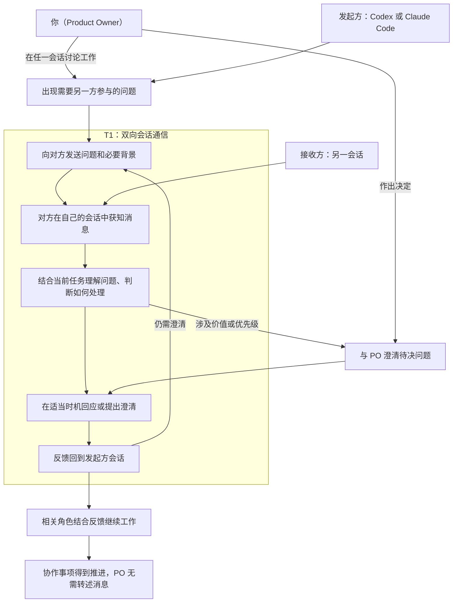

# Product Backlog

## 1. Product、Product Vision、Product Goal 与 DoD

### product

本产品是一个运行在本机环境中的 Codex 与 Claude Code 双向会话通信桥，让两个独立现有会话能够主动发送工作消息、接收回复并继续对话，使 PO 无需代为搬运消息。

<small><em>产品当前以已验证的最小原生双向桥为骨架：Claude→Codex 使用本地待收消息、queue 唤醒与 Hook 交付；Codex→Claude 使用原生命名管道并固定普通消息 `priority=next`。设计证据见 [Cross-Session Agent Messaging](../docs/ideo-design/cross-session-agent-messaging.md)。</em></small>

### Product Vision 与 Product Goal

**Product Vision**

让你、Codex 和 Claude Code 形成一个分工清楚、沟通顺畅的协作团队，能够共同澄清问题、讨论计划、参与评审，并将讨论结果落实为行动，持续推进项目、交付你认可的成果。

<small><em>你决定价值方向与优先级；Codex 通常承担 Scrum Master，Claude Code 通常承担 Developer 或其他角色。你可以在任一会话参与讨论，由该会话向另一方发送需要澄清的问题和背景，再将收到的意见用于继续讨论。</em></small>

**Product Goal**

让 PO 在实际项目中，通过 Codex 与 Claude Code 两个原始会话的直接交流，完成需求澄清和评审协作，将双方反馈用于推进决定或行动，无需人工转述跨会话消息。

首批用户为 PO 本人，产品成效以其真实使用体验检视。

### DoD

#### Definition of Outcome Done

PO 在真实使用场景中亲身体验产品，确认当前 Product Goal 所约定的价值已经实现，并记录体验场景与结论。

#### Definition of Output Done

Increment 已集成到产品中，可通过标准产品入口使用，通过与其声明范围相适应的质量验证，并由 PO 按事先约定的验收标准验收通过。

## 2. Product Backlog Items

本节只保留未完成事项。编号用于追溯，不表示优先级；以下条目围绕当前 Product Goal 持续精化，已交付的 1.0.0 能力见第三节。最终排序由 PO 决定，工作量和实现方式由 Developer 评估。各项验收标准写在备注中，并须同时满足 Definition of Output Done；尚待明确的范围继续精化。

2026-09-12，PO 确认 Sprint 03 范围纳入 PBI-09、PBI-10、PBI-12、PBI-13：PBI-12 先解决多个候选中辨认并选对当前目标，PBI-11 的多个配对同时保持留在 Sprint 04。范围决定不等于新的验收细节已全部确认、Developer 已承诺容量或产品已完成。范围与逐项验收提案分别见 [Sprint 03 Backlog](sprint-03-usability-polish/SprintBacklog.md) 与 [Sprint 04 Backlog](sprint-04-multi-claude-sessions/SprintBacklog.md)；下列五项的验收摘要与这两份审阅稿配套，精化时同步更新。

| 编号 | 标题 | 用户故事 | 架构定位 | 当前状态 | 备注 |
|---|---|---|---|---|---|
| PBI-02 | 发布使用说明与故障排查 | 作为首批用户，我要仅凭随版本提供的说明完成安装、配置和故障处理，以便在实际项目中使用产品。 | 文档覆盖发布物的使用路径、两个实测故障、身份边界与运行环境；与安装和维护能力保持一致。 | 待 Developer 评估 | 延续 Sprint 01 Review 的文档修正。验收：随版本提供的说明覆盖获取、前置条件、安装、项目配置、首次通信、维护与卸载，命令与发布物一致；可据此识别双侧数据目录不一致及 Claude 端点失效，保留旧数据并完成显式重配对；澄清身份环境变量用于路由匹配，区分 Node 最低前置与已验证版本，声明工具版本和能力限制，修正已失效的 Sprint Backlog 引用。端点失效识别与显式重配对指引切片已由 PBI-10 承接，本条验收仅约束其余范围。 |
| PBI-03 | 投递失败状态透明化 | 作为首批用户，我要看清消息的尝试投递、通道报错、待领取及有证据的领取状态，以免被本地记录误导。 | 改进 send-error、status 与消息记录的可解释性；证据不足时明确未知，领取不等于原会话已收到；不引入自动重试或送达回执。 | 待 Developer 评估 | 来自 Sprint 01 最终检视；是否纳入首版由 PO 排序决定。验收：标准状态入口可对照消息与事件，解释已发生的失败场景及已有的待领取或领取证据，证据不足时明确未知；`submitted:true`、通道写入及领取记录不被表述为原会话已收到，送达仍按接收方原始会话事件与唯一标记判定；报错但消息可能已发布或领取时，不诱导直接重发。status 人话化与换配对指引切片已由 PBI-10 承接，本条验收仅约束其余范围。 |
| PBI-06 | 从发布物安装并启用通信 | 作为首批用户，我要把取得的发布物安装到自己的实际项目中，以便无需开发工作区的现成配置即可开始跨会话协作。 | 明确安装位置、目标项目配置、前置依赖及首次启用路径，沿用已验证的双向通信能力与信任要求。 | 待 Developer 评估 | 为 PBI-05 提供安装能力。验收：PO 在声明支持的 Windows 环境中可按说明确定安装位置与目标项目，完成安装、必要信任、端点登记和配对；产品入口、hook 及回复指引指向实际安装位置，保留其他工具配置；两个选定原始会话完成真实双向通信，接收证据符合原始会话事件与唯一标记规则。 |
| PBI-07 | 安装维护与卸载 | 作为首批用户，我要能够重复安装、按说明升级及卸载产品，以便维护自己的安装并保留需要的数据。 | 定义安装生命周期、产品配置与用户数据的处理边界；后续版本兼容范围随版本声明。 | 待精化 | 验收：同版本重复安装不累积注册、不破坏其他工具配置，之后仍可通信；卸载移除产品集成配置与安装内容，保留其他工具配置，明确用户数据保留或清理方式且不静默丢失历史证据；升级约定说明版本替换、配置、配对和数据的处理，支持及验证场景经 Developer 评估后与 PO 明确，未验证的跨版本兼容性不作承诺。换配对旧数据归档切片已由 PBI-10 承接，本条验收仅约束其余范围。 |
| PBI-09 | 消息与标记呈现可读性 | 作为日常使用者，我要在两侧会话里直接读懂每条消息的内容与来龙去脉，而不是面对一串 UUID 和 JSON 倾倒，以便把注意力放在协作本身。 | 消息渲染、唤醒及处理提示可读，原会话接收与分层取证规则不回退；保留在途格式兼容约束，呈现与解析方案由 Developer 决定。 | Sprint 03 范围确认；未 Done | 验收审阅稿 S03-09-1 至 6：可读头行、完整正文和可执行回复入口；内部信息按需查证，来源边界明确；正常唤醒与处理提示可理解；双方向空闲收信触发新模型调用，工作中收信保持模型 / 工具边界；防重复、普通输入和在途旧格式兼容不回退；真实请求、回复、追问、再答关联正确。双树、产品文档及回归同步，安装后的候选验证，PO 无需手写标记、ID 或环境变量。 |
| PBI-10 | 桥状态一目了然与显式换配对 | 作为日常使用者，我要一眼看清当前有没有桥、属于哪两个会话、端点是否存活，并在换会话时按指引完成换配对，以便顺畅维护日常协作。 | 单配对状态、幂等沿用、旧证据归档与显式重建；不静默替换。与 PBI-13 共用状态事实和生命周期规则，本条负责状态含义及换配对，13 负责操作入口与断开；完整投递状态语义仍归 PBI-03。 | Sprint 03 重做范围（PO 确认；未 Done） | 验收审阅稿 S03-10-1 至 4：未配对有下一步，已配对摘要含创建时间、双侧身份、端点观察结果、Codex 待收单槽无 / 有及消息标识、最近事件；原始结构化信息另有入口，登记、进程和可联系性分清，未知不推定正常；同配对明确沿用，不同配对显式处理；换配对无需 PO 翻查或删除数据文件，归档可追溯、多次不覆盖，失败状态诚实；沿用与重建两轮均含真实收发。待收处置与 13 一致，双树、文档和安装入口验证同步。 |
| PBI-11 | 一 Codex 对多 Claude Code 会话 | 作为日常使用者，我要让一个 Codex 会话同时与多个 Claude Code 会话保持桥接并按名称往来，以便并行开展多项协作，而不是每次换目标都要换配对。 | 将现有单对模型扩展为多配对共存、确定目标的路由及回复关联；承接 Sprint 03 的目标辨识、呈现、状态和生命周期规则，在多目标下扩展与复验。架构、容量和迁移策略待研究。 | Sprint 04 方向（PO 确认；Planning 草案，未开工） | PO 于 2026-09-12 再次确认多配对同时保持留在 Sprint 04。验收审阅稿 S04-11-1 至 8：同一 Codex 与至少两个原始 Claude 配对共存，发送目标确定，回复绑定原消息；两条交流完整往返及切换后回复旧消息均正确；相近时间来信的接纳、等待或拒绝有明确结果，无静默覆盖、串目标或重复注入；单目标断开 / 重启 / 重连不影响其他目标；单目标路径和旧数据处理明确；双树与标准安装入口同步。不承诺任意规模、广播或并发吞吐，仍须研究重叠来信的处理边界。验收细节与团队交付预测尚未确认。 |
| PBI-12 | 多会话协作中的目标辨识 | 作为同时管理多个 Claude Code 会话的日常使用者，我要在发送前清楚知道消息将进入哪个原始会话，并能发现目标选择错误，以免把消息发给错误的会话。 | 本次先解决多个候选中的目标辨认、项目上下文和误选纠正，仍只保持一个有效配对；具体交互和技术方案待研究，不预设确认按钮。多配对同时保持及其扩展验证归 Sprint 04 / PBI-11。 | Sprint 03 范围确认；待研究精化 | 来自 Sprint 04 方向讨论中暴露的误投风险。验收审阅稿 S03-12-1 至 4：选择和发送前有足够的名称、项目与原会话辨识依据；歧义或信息不足不猜测，错误选择能在业务发送前取消或纠正；投递与回复绑定正确原会话，身份变化不静默改投；至少两个真实候选参与辨识与误选场景，正确目标收到、其他候选无误收入站事件，PO 不手写 ID。是否需要额外确认及同名处理方式待研究后与 PO 明确。 |
| PBI-13 | 插件连接状态与生命周期操作 | 作为日常使用者，我要能快速检查插件与桥接连接的当前状态，并在需要时明确结束、断开或处理连接，以便不必翻查数据目录或依赖记忆排查日常连接问题。 | 标准产品入口中的状态与显式连接操作，复用 PBI-10 的状态和归档规则，补足断开及后续重连；共同工作不重复计工。审阅稿的结束范围为桥接关系，不隐含终止宿主进程或卸载插件；具体入口与在途规则待研究。 | Sprint 03 范围确认；待研究精化 | 来自日常使用中缺少快捷状态与连接操作路径的反馈。验收审阅稿 S03-13-1 至 4：入口可发现，可观察的插件与桥状态分清，未知不推定可用；断开对象、影响、数据保留及结果明确，重复断开稳定，旧连接不再接受新发送 / 回复，可显式重连；待收与在途消息处置及失败状态明确，证据不静默丢失，旧消息不误投新目标；安装后真实检查、断开、重连和双向交流验证。新增细节待研究后与 PO 明确，完整安装维护仍归 PBI-07。 |

## 3. 产品架构与已交付能力

### 协作地图

参与者：你（Product Owner）、Codex、Claude Code。图中按本次消息的方向将 Codex 与 Claude Code 分为发起方和接收方，两者可以互换。

起点：一方在项目工作中遇到需要另一方参与的问题；这也可以来自你与该方的讨论。

结束状态：反馈回到发起方会话并用于推进协作事项，你无需代为搬运消息。

<small><em>此图来自 Design Sprint 的协作地图，保留为 Product Backlog 的价值流背景。PO 可在任一会话参与；涉及价值或优先级时，由相关会话向 PO 澄清。接收方自行决定如何处理及何时回应。</em></small>

<small><em>“获知消息”和“反馈回到会话”均遵循已确认的接收规则：空闲时，消息触发新的模型调用；工作中，消息先排队，在当前模型调用及其工具执行结束后、下一次模型调用前进入上下文，此时原任务可以尚未完成。</em></small>

<small><em>检视位置：双方获知消息对应通信可靠性；提供背景与理解问题对应消息质量；回应和追问对应连续对话；判断处理及接续工作对应协作行动；PO 的实际参与负担对应产品价值。</em></small>

### 已交付能力

- PBI-08（Sprint 02）：已交付 Codex CLI 插件，封装双向 bridge、连接 skill 与必要 hooks；用户指定正在运行的 Claude 会话即可自动建联，用户无需手动登记端点、复制会话 ID 或管理桥数据目录，Claude 侧无需安装插件或手动配置桥。保留宿主必要授权，沿用 Windows 本机、单对原始会话、短文本串行通信。候选 2 技术 AC 与 PO DoD 均已通过，PO 明确表示“满意，通过我负责的DoD”。版本、场景与证据见 [Sprint 02 Review](../docs/scrum-sprint/sprint-02-install-package-release-review.md)。
- PBI-05（Sprint 02）：交付公开 GitHub 仓库的 1.0.0 版本分发，提供 marketplace 安装入口、插件 ZIP、manifest、校验值和版本说明。产品增量经技术与 PO 验收通过，Review/Retro 收口后按 PO 授权正式发布；v1.0.0 标签包含最终总结与长期记忆，发布包与已验收候选一致。版本与证据追溯见 [Sprint 02 Review](../docs/scrum-sprint/sprint-02-install-package-release-review.md)。
- PBI-01（Sprint 01）：已交付 Windows 本机、单对原始会话、短文本串行双向通信桥，可通过标准 CLI 入口安装、配置、发送与回复。Claude→Codex 使用本地待收消息、queue 唤醒与 Hook 交付；Codex→Claude 使用原生命名管道，普通消息固定 `priority=next`。
- PO 最终检查通过，含偏差记录。已验证范围、限制与验收证据见 [Sprint 01 Bridge Review & Retro](../docs/scrum-sprint/sprint-01-bridge-review-retro.md)。

### 已完成的产品约定

- PBI-04（本次 Product Backlog 梳理）：PO 已确认以亲身真实体验判断产品成效；Definition of Outcome Done 与结论记录要求已写入第一节，具体体验场景随相关 PBI 的备注明确。该条目的定义工作完成，实际产品成效将在真实使用后检视。
