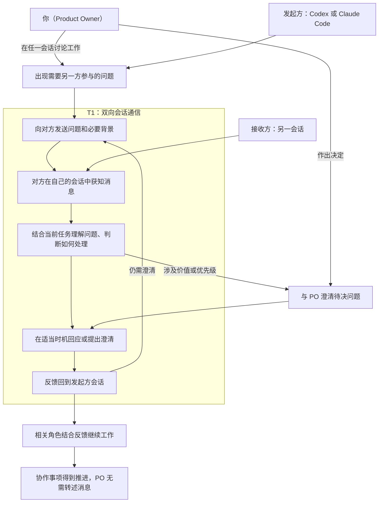

# Product Backlog

## 1. Product、Product Vision 与 DoD

### product

本产品是一个运行在本机环境中的 Codex 与 Claude Code 双向会话通信桥，让两个独立现有会话能够主动发送工作消息、接收回复并继续对话，使 PO 无需代为搬运消息。

<small><em>产品当前以已验证的最小原生双向桥为骨架：Claude→Codex 使用本地待收消息、queue 唤醒与 Hook 交付；Codex→Claude 使用原生命名管道并固定普通消息 `priority=next`。设计证据见 [Cross-Session Agent Messaging](../docs/ideo-design/cross-session-agent-messaging.md)。</em></small>

### product vision

让你、Codex 和 Claude Code 形成一个分工清楚、沟通顺畅的协作团队，能够共同澄清问题、讨论计划、参与评审，并将讨论结果落实为行动，持续推进项目、交付你认可的成果。

<small><em>你决定价值方向与优先级；Codex 通常承担 Scrum Master，Claude Code 通常承担 Developer 或其他角色。你可以在任一会话参与讨论，由该会话向另一方发送需要澄清的问题和背景，再将收到的意见用于继续讨论。</em></small>

### DoD

#### Definition of Outcome Done

待补充。

#### Definition of Output Done

Increment 已集成到产品中，可通过标准产品入口使用，并通过与其声明范围相适应的质量验证。

## 2. Product Backlog Items

| 编号 | 标题 | 用户故事 | 架构定位 | 当前状态 | 备注 |
|---|---|---|---|---|---|
| PBI-01 | 产品化已验证的跨会话双向消息桥 | 作为 PO，我要在 Codex 与 Claude Code 的现有会话之间直接发送和接收工作消息，以便无需搬运上下文即可推进协作。 | 将 Design Sprint 已验证的最小原生双向桥产品化；不扩展到重启恢复、并发、多会话、远程协作等未验证范围。 | 已选择，已精化 | 首个 Increment 聚焦已验证的短消息双向通信路径。 |

## 3. map

参与者：你（Product Owner）、Codex、Claude Code。图中按本次消息的方向将 Codex 与 Claude Code 分为发起方和接收方，两者可以互换。

起点：一方在项目工作中遇到需要另一方参与的问题；这也可以来自你与该方的讨论。

结束状态：反馈回到发起方会话并用于推进协作事项，你无需代为搬运消息。

<small><em>此图来自 Design Sprint 的协作地图，保留为 Product Backlog 的价值流背景。PO 可在任一会话参与；涉及价值或优先级时，由相关会话向 PO 澄清。接收方自行决定如何处理及何时回应。</em></small>

<small><em>“获知消息”和“反馈回到会话”均遵循已确认的接收规则：空闲时，消息触发新的模型调用；工作中，消息先排队，在当前模型调用及其工具执行结束后、下一次模型调用前进入上下文，此时原任务可以尚未完成。</em></small>

<small><em>检视位置：双方获知消息对应通信可靠性；提供背景与理解问题对应消息质量；回应和追问对应连续对话；判断处理及接续工作对应协作行动；PO 的实际参与负担对应产品价值。</em></small>
