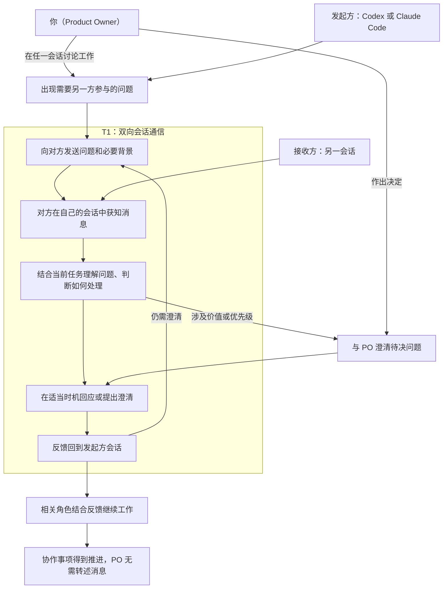

# Product Backlog

## 1. Product、Product Vision、Product Goal 与 DoD

### product

本产品是一个运行在本机环境中的 Codex 与 Claude Code 双向会话通信桥，让两个独立现有会话能够主动发送工作消息、接收回复并继续对话，使 PO 无需代为搬运消息。

<small><em>产品当前以已验证的最小原生双向桥为骨架：Claude→Codex 使用本地待收消息、queue 唤醒与 Hook 交付；Codex→Claude 使用原生命名管道并固定普通消息 `priority=next`。设计证据见 [Cross-Session Agent Messaging](../docs/ideo-design/cross-session-agent-messaging.md)。</em></small>

### Product Vision 与 Product Goal

**Product Vision**

让你、Codex 和 Claude Code 形成一个分工清楚、沟通顺畅的协作团队，能够共同澄清问题、讨论计划、参与评审，并将讨论结果落实为行动，持续推进项目、交付你认可的成果。

<small><em>你决定价值方向与优先级；Codex 通常承担 Scrum Master，Claude Code 通常承担 Developer 或其他角色。你可以在任一会话参与讨论，由该会话向另一方发送需要澄清的问题和背景，再将收到的意见用于继续讨论。</em></small>

**Product Goal**

让 PO 在实际项目中，通过 Codex 与 Claude Code 两个原始会话的直接交流，完成需求澄清和评审协作，将双方反馈用于推进决定或行动，无需人工转述跨会话消息。

首批用户为 PO 本人，产品成效以其真实使用体验检视。

### DoD

#### Definition of Outcome Done

PO 在真实使用场景中亲身体验产品，确认当前 Product Goal 所约定的价值已经实现，并记录体验场景与结论。

#### Definition of Output Done

Increment 已集成到产品中，可通过标准产品入口使用，通过与其声明范围相适应的质量验证，并由 PO 按事先约定的验收标准验收通过。

## 2. Product Backlog Items

本节只保留未完成事项。编号用于追溯，不表示优先级；以下条目围绕已由 PO 确认的 1.0.0 发布方向精化，最终排序由 PO 决定，工作量和实现方式由 Developer 评估。各项验收标准写在备注中，并须同时满足 Definition of Output Done；尚待明确的范围继续精化。

| 编号 | 标题 | 用户故事 | 架构定位 | 当前状态 | 备注 |
|---|---|---|---|---|---|
| PBI-02 | 发布使用说明与故障排查 | 作为首批用户，我要仅凭随版本提供的说明完成安装、配置和故障处理，以便在实际项目中使用产品。 | 文档覆盖发布物的使用路径、两个实测故障、身份边界与运行环境；与安装和维护能力保持一致。 | 待 Developer 评估 | 延续 Sprint 01 Review 的文档修正。验收：随版本提供的说明覆盖获取、前置条件、安装、项目配置、首次通信、维护与卸载，命令与发布物一致；可据此识别双侧数据目录不一致及 Claude 端点失效，保留旧数据并完成显式重配对；澄清身份环境变量用于路由匹配，区分 Node 最低前置与已验证版本，声明工具版本和能力限制，修正已失效的 Sprint Backlog 引用。端点失效识别与显式重配对指引切片已由 PBI-10 承接，本条验收仅约束其余范围。 |
| PBI-03 | 投递失败状态透明化 | 作为首批用户，我要看清消息的尝试投递、通道报错、待领取及有证据的领取状态，以免被本地记录误导。 | 改进 send-error、status 与消息记录的可解释性；证据不足时明确未知，领取不等于原会话已收到；不引入自动重试或送达回执。 | 待 Developer 评估 | 来自 Sprint 01 最终检视；是否纳入首版由 PO 排序决定。验收：标准状态入口可对照消息与事件，解释已发生的失败场景及已有的待领取或领取证据，证据不足时明确未知；`submitted:true`、通道写入及领取记录不被表述为原会话已收到，送达仍按接收方原始会话事件与唯一标记判定；报错但消息可能已发布或领取时，不诱导直接重发。status 人话化与换配对指引切片已由 PBI-10 承接，本条验收仅约束其余范围。 |
| PBI-06 | 从发布物安装并启用通信 | 作为首批用户，我要把取得的发布物安装到自己的实际项目中，以便无需开发工作区的现成配置即可开始跨会话协作。 | 明确安装位置、目标项目配置、前置依赖及首次启用路径，沿用已验证的双向通信能力与信任要求。 | 待 Developer 评估 | 为 PBI-05 提供安装能力。验收：PO 在声明支持的 Windows 环境中可按说明确定安装位置与目标项目，完成安装、必要信任、端点登记和配对；产品入口、hook 及回复指引指向实际安装位置，保留其他工具配置；两个选定原始会话完成真实双向通信，接收证据符合原始会话事件与唯一标记规则。 |
| PBI-07 | 安装维护与卸载 | 作为首批用户，我要能够重复安装、按说明升级及卸载产品，以便维护自己的安装并保留需要的数据。 | 定义安装生命周期、产品配置与用户数据的处理边界；后续版本兼容范围随版本声明。 | 待精化 | 验收：同版本重复安装不累积注册、不破坏其他工具配置，之后仍可通信；卸载移除产品集成配置与安装内容，保留其他工具配置，明确用户数据保留或清理方式且不静默丢失历史证据；升级约定说明版本替换、配置、配对和数据的处理，支持及验证场景经 Developer 评估后与 PO 明确，未验证的跨版本兼容性不作承诺。换配对旧数据归档切片已由 PBI-10 承接，本条验收仅约束其余范围。 |
| PBI-09 | 消息与标记呈现可读性 | 作为日常使用者，我要在两侧会话里直接读懂每条消息的内容与来龙去脉，而不是面对一串 UUID 和 JSON 倾倒，以便把注意力放在协作本身。 | 改进接收侧消息渲染与唤醒呈现的可读性；两侧共用同一渲染函数（为其增加方向参数以区分两侧声明）；唤醒标记保持机器可解析格式不变，可读化在投递呈现层实现；不改变投递机制与分层取证规则。来自 Sprint 03 Planning 前的真实使用反馈。 | Sprint 03 选中 | 验收：1) 两侧收到的消息呈可读结构：首行为信息最密头（发送方＋createdAt＋回复标记，一行），随后正文全文，末尾完整回复入口命令（Claude 侧宿主单行预览因此直接可读）；2) 不再全量输出内部字段（pairId、conversationId、双侧 sessionId 等），完整 messageId 保留于回复入口命令，其余可经 status/数据目录按需查证，证据链不以渲染文本为载体，分层取证规则不变；3) Claude 侧不重复宿主原生安全声明（真实验证轮实证可见来源标识仍存），Codex 侧保留简短等价声明，渲染函数按方向区分；4) Codex 侧唤醒呈现附可读说明、不再只是裸代号（UUID 保留作机器依据），唤醒标记解析契约不变（规划既定：不改标记文本，可读化在投递呈现层实现），已消费唤醒的重复抑制与消息本体防重复投递行为不回退；5) 唤醒相关用户可见文案（already supplied／no pending body 等）同步给出可读版本；6) 渲染与解析契约的变更均随对应回归测试同步更新；7) 改动同步落位 bridge/ 与 plugins/claudetocodex/bridge/ 并保持一致，真实验证经安装后的标准产品入口执行；8) 双侧真实往返验证（请求、回复、追问各至少一次），接收方原始会话事件与关联字段核对通过，PO 无需手写标记、ID 或环境变量。 |
| PBI-10 | 桥状态一目了然与显式换配对 | 作为日常使用者，我要一眼看清当前有没有桥、属于哪两个会话、端点是否存活，并在换会话时按指引完成换配对，以便顺畅维护日常协作。 | status 人话化（含未配对分支）与 connect 先查后连（复用既有配对比较逻辑，指引随插件分发）；换配对给出连贯的显式指引（含旧数据归档命令，归档目录带时间戳可多份并存）；保留「不静默替换配对」边界；不定义超出单槽 0/1 的投递语义（该范围归 PBI-03）。 | Sprint 03 选中 | 验收：1) status 默认输出人话摘要：未配对时输出明确提示与下一步连接指引（而非报错）；已配对时含现有配对与创建时间、两侧会话标识、Claude 端点三态（运行中／已停止／未登记，后两态附需显式换配对指引）、待领取消息（单槽：无／有并附消息 ID）、最近事件摘要；原始 JSON 另有入口；2) 连接流程先查后连（复用同一比较逻辑）：相同配对直接沿用；不同配对时给出连贯的显式换配对指引（允许若干条明确命令，含旧数据归档命令，指引随插件分发），不静默替换；3) 换配对全程按指引命令完成，无需手动浏览或删除数据目录内文件；归档目录带时间戳命名、多次换配对不互相覆盖，归档路径记录在案、可查，历史证据不静默丢失；4) 真实场景验证两轮（同配对沿用、换会话重建），每轮含一次真实消息收发，接收证据按接收方原始会话入站事件＋messageId/pairId/conversationId/replyTo＋数据目录＋时间窗判定，重建轮次的旧证据以归档目录留存；5) 文档同步：SKILL.md Connect 段与 USAGE.md 的 status 对账行、错误对照表随改动同步更新；6) 改动同步落位 bridge/ 与 plugins/claudetocodex/bridge/ 并保持一致，真实验证经安装后的标准产品入口执行。 |
| PBI-11 | 一 Codex 对多 Claude Code 会话 | 作为日常使用者，我要让一个 Codex 会话同时与多个 Claude Code 会话保持桥接并按名称往来，以便并行开展多项协作，而不是每次换目标都要换配对。 | 现行桥为单对模型：单数据目录、单 pair.json、发送方身份校验限单会话；多会话需多配对共存、按会话名称寻址与路由、状态与换配对边界相应扩展；具体架构待精化评估（含与 PBI-10 换配对路径的关系）。 | 待精化 | 来自 PO 2026-09-10 提议，先入 Product Backlog 不入当前 Sprint。验收标准待精化后与 PO 明确；静默替换与显式归档边界沿用既定规则，多会话不等于自动切换或并发投递语义的默认承诺。 |

## 3. 产品架构与已交付能力

### 协作地图

参与者：你（Product Owner）、Codex、Claude Code。图中按本次消息的方向将 Codex 与 Claude Code 分为发起方和接收方，两者可以互换。

起点：一方在项目工作中遇到需要另一方参与的问题；这也可以来自你与该方的讨论。

结束状态：反馈回到发起方会话并用于推进协作事项，你无需代为搬运消息。

<small><em>此图来自 Design Sprint 的协作地图，保留为 Product Backlog 的价值流背景。PO 可在任一会话参与；涉及价值或优先级时，由相关会话向 PO 澄清。接收方自行决定如何处理及何时回应。</em></small>

<small><em>“获知消息”和“反馈回到会话”均遵循已确认的接收规则：空闲时，消息触发新的模型调用；工作中，消息先排队，在当前模型调用及其工具执行结束后、下一次模型调用前进入上下文，此时原任务可以尚未完成。</em></small>

<small><em>检视位置：双方获知消息对应通信可靠性；提供背景与理解问题对应消息质量；回应和追问对应连续对话；判断处理及接续工作对应协作行动；PO 的实际参与负担对应产品价值。</em></small>

### 已交付能力

- PBI-08（Sprint 02）：已交付 Codex CLI 插件，封装双向 bridge、连接 skill 与必要 hooks；用户指定正在运行的 Claude 会话即可自动建联，用户无需手动登记端点、复制会话 ID 或管理桥数据目录，Claude 侧无需安装插件或手动配置桥。保留宿主必要授权，沿用 Windows 本机、单对原始会话、短文本串行通信。候选 2 技术 AC 与 PO DoD 均已通过，PO 明确表示“满意，通过我负责的DoD”。版本、场景与证据见 [Sprint 02 Review](../docs/scrum-sprint/sprint-02-install-package-release-review.md)。
- PBI-05（Sprint 02）：交付公开 GitHub 仓库的 1.0.0 版本分发，提供 marketplace 安装入口、插件 ZIP、manifest、校验值和版本说明。产品增量经技术与 PO 验收通过，Review/Retro 收口后按 PO 授权正式发布；v1.0.0 标签包含最终总结与长期记忆，发布包与已验收候选一致。版本与证据追溯见 [Sprint 02 Review](../docs/scrum-sprint/sprint-02-install-package-release-review.md)。
- PBI-01（Sprint 01）：已交付 Windows 本机、单对原始会话、短文本串行双向通信桥，可通过标准 CLI 入口安装、配置、发送与回复。Claude→Codex 使用本地待收消息、queue 唤醒与 Hook 交付；Codex→Claude 使用原生命名管道，普通消息固定 `priority=next`。
- PO 最终检查通过，含偏差记录。已验证范围、限制与验收证据见 [Sprint 01 Bridge Review & Retro](../docs/scrum-sprint/sprint-01-bridge-review-retro.md)。

### 已完成的产品约定

- PBI-04（本次 Product Backlog 梳理）：PO 已确认以亲身真实体验判断产品成效；Definition of Outcome Done 与结论记录要求已写入第一节，具体体验场景随相关 PBI 的备注明确。该条目的定义工作完成，实际产品成效将在真实使用后检视。
