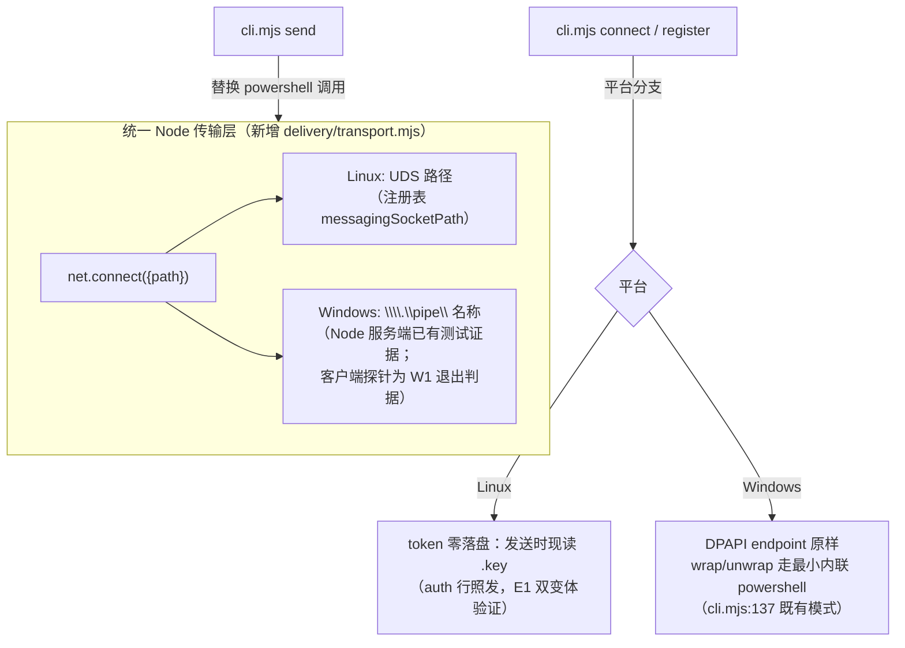

# Sprint 08 HOW：Linux 版本功能对等交付（Developer 主导稿 v2）

- 日期：2026-09-18。v1 经三视角对抗自审（SM 验收／工程／边界，处置记录见文末附录）修订。
- 依据：SprintBacklog v02（12 项 AC＋证据矩阵）、E1/E2 预研结论（`experiments/`）、环境事实核查、代码全量扫描。
- 状态：Developer 提案，待 SM 审阅、PO 检视。含两项 PO 确认点（D-B、D-E）与一项时长取舍。

## 0. 预研结论摘要（HOW 的证据基础）

| 簇 | 结论 | 出处 |
|---|---|---|
| A：Claude UDS 帧与认证 | **关闭**。auth 行＋`msgV`/`priority=next`/`session_id` 帧集合在 Linux UDS 原样可用；auth 可选；空闲/生成中/工具中三态语义与 Windows 基线一致（工具中=回合内 `absorbed_mid_turn`）；宿主进程证据验证工作（`verifiedPeerPid`）。**Linux 侧版本漂移关闭（2.1.275 已验）；Windows 侧 2.1.273 漂移照 §6 如实记录** | E1-RESULTS |
| B：Codex hooks/queue | **关闭**。三类 hook 触发且字段形状与产品依赖一致（`session_id`/`turn_id`/`tool_use_id`）；hook 环境无 `CODEX_THREAD_ID`（走事件载荷，正确路径）；`codex queue` 投递＋空闲自动续接；pending 最旧兜底领取（context-prepared/claim/receipt）；注入进模型上下文（rollout response_item）；跨轮唤醒抑制原样复现；PO `/hooks` 信任流程可用；**Linux** 隔离 home＋glm 模型接入配方成立 | E2-RESULTS |
| 测试基线 | Linux 现状 87 tests：72 过/10 败/5 skip。败因=Windows 路径 fixture＋powershell 依赖；**skip 含 store.test 两项 CLI 集成测试（Linux 覆盖为零，须移植非仅修败）**（D-H⑤） | 本轮实测＋自审复算一致 |
| 环境事实 | 本机 Windows 侧存在历史回归环境（codex 0.154.0/claude 2.1.273/node 24.14.0/D:\ClaudeToCodex；powershell.exe interop 实测可用）；**Windows 侧隔离 home、可用模型与信任安排仍未落实**，为 W10 前置 Operator 项（见 §4 W10-pre、§6） | 环境核查＋windows-interop 实测 |

## 1. 技术方案总览

原则：**统一 Node 传输层；无第三方依赖（Node stdlib；Windows 侧 DPAPI 经最小内联 `powershell -Command` 保留，见 D-A/D-B）**；Windows 既有行为优先保持；Linux 按官方机制适配。

**通用约束（适用每个切片）**：任何 `bridge/` 改动同 commit 同步 `plugins/claudetocodex/bridge/` 并保持字节一致（18-4 验收时整树核对）；不引入第三方依赖。

## 2. 决策表（含备选与影响）

| # | 决策点 | 选定方案 | 备选与取舍 | 变更影响→回归 |
|---|---|---|---|---|
| D-A | Codex→Claude 投递 | 新增 `delivery/transport.mjs`：Node `net.connect` 客户端；auth 行＋消息帧逻辑自 `Send-ClaudePipe.ps1` 等价移植；Linux 连 UDS、Windows 连命名管道。**Windows token 解包＝最小内联 `powershell -Command`（token 经 env 传入、stdout 捕获即弃、记录与错误路径一律不回显）**。等价性定义为 W1 单测清单逐项通过：①auth→500ms→帧时序与 LF 换行；②`wire/*.send.json` 双写契约（先 `not-completed` 后回写，崩溃留尝试证据）；③`completed` 只在 write 回调＋end/close 后写；④自建连接超时（5000ms）与总预算；⑤错误分类（ENOENT/ECONNREFUSED/EPIPE/超时各自如实文案；错误 token 不可区分于 unverified、不重试） | 备选：双脚本（.ps1＋.sh）——拒绝：协议双实现漂移 | **Windows 投递路径变更**（.ps1 退役、解包改内联 powershell）→ 回归含 Windows 真实往返＋错误路径（W10）；**W1 退出判据含 Windows 命名管道客户端探针**（interop 在 Windows 侧跑 fixture 服务端＋transport 客户端连写），使回滚决断点有真实证据 |
| D-B | token 处理（**PO 确认点**） | **Linux：token 零落盘**——endpoint 只存 sessionId/socket/cwd/name；发送时按 sessionId 反查注册表（**绝不按 pid/socket 误投**）现读 `.key` 的 `peerToken`，经环境变量传给传输层；auth 行照发。**Windows：DPAPI endpoint 原样**（wrap/unwrap 内联 powershell，保留三处调用清单：connect wrap、register wrap、send unwrap） | (a) endpoint 0600 明文：桥数据根泄露=token 泄露；(b-1) Linux 免 auth：最少接触但策略变化即断；(c) Windows 也改现读：可全退役 DPAPI，但改变 Windows 既有安全姿态与回归面——列为 PO 备选。推荐方案保证=桥数据根无秘密落盘、会话存活期内可投递、死亡/竞态如实报错 | Linux 全新路径；Windows 机制不变（调用形态微调）。W2 竞态 fixture 四类：stale 记录、.key 半写/缺失、PID 复用（sessionId 不符）、发送中会话死亡——一律诚实失败提示 reconnect，不自动重试 |
| D-C | Linux 数据根 | `~/.local/share/ClaudeToCodex`（尊重 `XDG_DATA_HOME`）；Windows `LOCALAPPDATA` 不变。**改动点三处**：`store.mjs:17-21`、`roots.mjs:24-27`、`roots.mjs:29-32`——收敛为共享根助手＋"三处一致"漂移测试 | 备选 `~/.claudetocodex`：不合惯例 | 仅新增分支；Windows 不变 |
| D-D | 回复指引语法 | `renderPeer` 平台分支：Linux 用 POSIX env 前缀；**路径含单引号的转义规则明确定义**（`'\''` 转义）＋含空格/引号路径测试；Windows 维持 `$env:` | E2 活证据：`$env:` 指引 Linux 不可执行（S03"可执行回复入口"AC） | Windows 文本不变 |
| D-E | PowerShell 退役与包内容（**PO 确认点**） | `delivery/` 三脚本退役（逻辑入 Node：transport.mjs＋queue 直调＋register Node 化；**Windows DPAPI 三处内联调用保留**）。`release/`：**Build/Verify 以 Node 重写**——zip 策略：`git archive` 产内容＋Node 最小 deflate zip writer（约百余行，UTF-8 flag/时间戳细节单测）；Verify 解析中央目录只读校验。**Test-Acceptance 移植（W7b）可后置**（预授权降级项，见 §4）。插件树移除 .ps1，包内容变化计入 manifest（PBI-18-4）。**失败回退决断点**：若 zip writer 或构建校验不过（触发：W7a 退出前未通过结构对照），回退保留 .ps1 一个版本并明示包内容差异，属 PO 可见决策 | 备选：release 留 Windows-only——拒绝：死重＋SM 无法在验收环境复跑 | 构建产物内容变化；Windows 构建流程改走 Node。§3 补 register/pair 回归行 |
| D-F | 会话选择校验 | `sessions.mjs:62` 平台分支：win32 校验 `\\.\pipe\` 前缀；**Linux** 校验绝对 UDS 路径（macOS 不做任何支持声明，同分支仅为绝对路径的防御性放行） | — | 无 Windows 影响 |
| D-G | queue 唤醒 | `cli.mjs` 直接 `execFile('codex',['queue',...])`，删 `BridgeQueue.ps1`；保留超时与 `wake-submitted` 事件 stdout 记录语义（现 cli.mjs:281-285 行为）；queue 失败走 send-error 事件留证 | E2 证明 Linux 原生投递 | Windows 唤醒路径等价替换→W10 冒烟 |
| D-H | 测试移植 | ①`connect.test.mjs` 无守卫 powershell 移植；②`pipe.test.mjs` 平台分支＋**两平台客户端都走 transport.mjs**；③Windows 路径 fixture 平台中性化；④**⑤移植 store.test:617/639 两项 CLI 集成测试到 Linux**（UDS fixture 服务端＋PATH codex 假 shim）；⑥W5 退出判据：**双平台零残留 skip**（skip 计数不随迁移残留） | — | Windows 测试语义不变 |

## 3. 变更影响 → Windows 回归映射

| 触及模块 | Windows 是否变更 | 回归场景（最小） |
|---|---|---|
| 投递传输＋DPAPI 解包形态（D-A/D-B） | **是**（.ps1→node＋内联解包） | Windows 真实 Codex→Claude 往返（T01XC/T03XC/T04XC 抽样）＋死端点错误路径＋`wire/*.send.json` 契约断言 |
| queue 唤醒（D-G） | 是（薄包装替换） | T02CX/T05 冒烟 |
| token/endpoint（D-B） | 机制不变（调用形态微调） | connect→send 冒烟＋引用历史证据＋适用性说明 |
| **register/pair 低层路径（D-E）** | **是**（.ps1→Node＋内联 wrap） | **register→pair→一次真实往返冒烟**（S08-18-3 Windows 侧对应） |
| 数据根/renderPeer/sessions（D-C/D/D/F） | 否 | 单测覆盖 |
| hooks/install | 否 | 引用历史 |
| 发布工具（D-E） | 是（Node 重写） | W7a 退出即含一次真实构建＋Verify＋新旧 manifest 结构对照（Linux 侧）；W10 补 Windows 侧运行新工具冒烟 |
| **Windows 回归环境与证据来源** | —— | **本机 Windows 侧**；**证据来源＝同一冻结 commit 的候选安装**（与 Linux 同源构建物在 Windows 侧安装后实测），非工作树；工具版本如实记录（claude 2.1.273 漂移声明）；W10-pre 由 Operator 落实隔离 home/模型/信任安排并留证（E2 配方仅 Linux 结论，Windows 不机械套用） |

## 4. 工作项切片、依赖与执行顺序（候选优先）

执行序：**代码（W1–W5）→ 文档（W6）→ 构建工具（W7a）→ 冻结 commit 构建候选并安装（WC）→ 现场两轮（W8/W9，均在安装候选上）→ Windows 回归（W10）→ PO 终验（W11）→ 收口（W12）**。W8/W9/W10/W11 的"现场"证据一律取自最终安装候选（SprintBacklog 证据矩阵口径）。

| # | 切片 | 估时 | 依赖／要点 |
|---|---|---|---|
| W1 | `transport.mjs`＋cli send 接线＋单测清单（§2 D-A 五点）＋**Windows 管道客户端探针** | 1d | 退出判据含探针通过；探针失败=回滚决断点（触发条件：连接/写帧/认证任一不过；决断人 Developer＋PO 知会；含义：Windows 恢复 .ps1 客户端分支、Linux 继续统一路径） |
| W2 | token 平台分支（Linux 现读/Windows 内联 DPAPI）＋sessions 校验（D-F）＋**竞态 fixture 四类** | 1d | W1 |
| W3 | queue 直调＋register Node 化＋删 delivery .ps1 | 0.5d | **W1＋W2**（register 依赖 token 路径） |
| W4 | 数据根三处收敛（D-C）＋renderPeer 平台语法＋转义规则＋注释修正（procStart 等） | 1d | — |
| W5 | 测试移植（D-H①–⑥） | 1d | W1–W4；退出判据：双平台零残留 skip |
| W6 | 文档六件：README/INSTALL/RELEASE-NOTES/USAGE/SMOKE＋**SKILL.md**（POSIX 定位块、双平台边界、sessionId 歧义提醒）＋**plugin.json description**；SMOKE Linux 程序（隔离 home 模板、全量环境清洗清单、C-m 提交、首 turn 前置、证据路径、**crossSessionInbound 授权步骤说明**） | 1d | W4 |
| W7a | release Build＋Verify Node 化（zip writer＋中央目录校验）＋真实构建＋新旧 manifest 结构对照 | 1d | W5；失败回退决断点（D-E） |
| W7b | Test-Acceptance 移植（291 行：fixture/泄漏扫描/双树 parity/编排） | 1d | W7a；**预授权可后置**（降级顺序首位，后置期间以 SMOKE 手工程序＋W5 测试替代，SM 复核） |
| WC | 冻结 commit→构建候选→安装进 Linux 隔离 home（Operator，回显目标 home、核验 installedPath） | 0.5d | W7a |
| W8 | 现场 R1：**安装候选上**全量矩阵第一轮（T 系＋REG＋MT/R/S03 系完整跑；含产品 send/reply 全路径与 `CODEX_THREAD_ID` 工具环境实证、16-1 输入变体、16-4 对抗样本、17-4 legacy 样本【有来源说明】） | 1d | WC；PO 动作：R1 隔离 home `/hooks` 信任＋Claude 接收策略 |
| W9 | 现场 R2：**同一冻结 commit** 全量矩阵第二轮（独立 runId/全新会话与 marker；抽样＋PO 体验轮适用证据须逐格列映射，缺省全跑） | 1d | W8；PO 动作：R2 home 信任 |
| W10-pre | Windows 侧环境落实：隔离 home、可用模型、启动/信任安排（Operator，留证；SM 复核） | 0.5d | 并行于 W8/W9 |
| W10 | Windows 回归（§3 最小集，证据来源＝同源候选 Windows 侧安装） | 1d | W10-pre＋WC |
| W11 | 最终候选核验：生效 hooks/skill/回复入口来源、REG 复核（install→信任→首通）＋PO 体验轮（真实需求澄清、两目标交错追问、crossSessionInbound 授权体验） | 1d | W9＋W10；PO 动作：候选信任＋体验轮（若 WC 后代码有变：重建＋差异场景重跑，明示） |
| W12 | Review/Retro 材料、发布准备（版本与公开发布由 PO 决策） | 0.5d | W11；可溢出至 Review 事件内 |

**容量声明**：合计 12d（不含 W7b）／13d（含）。**建议 Sprint 时长 2.5 周（≈13 工作日容量，含 1d 机动）**。若 PO 压缩至 2 周：W7b 后置（−1d）＋W12 并入 Review（−0.5d）后仍缺 ~0.5–1d，唯一进一步可协商项为 W10 压缩为"传输冒烟＋测试套"（省 0.5d，**削弱 18-4 Windows 回归覆盖，须 PO 明示接受**）；W8/W9 两轮口径不可裁。触顶按"先回报再协商"纪律。

## 5. 验证安排

- **分层**：fixture 单测（W1–W5）→ **安装候选现场两轮**（W8/W9，同一冻结 commit、独立 runId、全新会话与 marker、SM 独立核对；候选来源与 installedPath 留证）→ Windows 回归（W10，同源候选）→ PO 体验轮（W11）。**开发树调试允许但不产生验收证据**。
- **PO 动作集（归批，四处）**：R1 home 信任＋接收策略｜R2 home 信任｜最终候选信任＋resume｜体验轮＋crossSessionInbound 授权。每处 Operator 预置到最小动作、记录实际执行者；W8/W9 不因 PO 等待中断——PO 批次前置排期。
- **Linux SMOKE 程序要点**（W6 落盘，全部实测来源）：node/PATH 前置检查；隔离 home 模板（真实变体 config＋`[projects]` 信任＋codex-models.json）；Claude scratch 从项目根启动＋**全量环境清洗清单**（`CLAUDE_CODE_SESSION_ID CODEX_THREAD_ID CLAUDE_CODE_MESSAGING_TOKEN CLAUDE_CODE_MESSAGING_SOCKET CLAUDE_PID CLAUDE_JOB_DIR CLAUDECODE` 或干净 shell——E2 发现的清单缺口）；tmux 用 `C-m` 提交；queue 前先建首 turn；证据路径（`$CODEX_HOME/sessions/**/rollout-*.jsonl`、`~/.claude/projects/**/<sessionId>.jsonl`）。
- **名称口径**：测试驱动与证据定位用 sessionId；**产品按名建联/歧义拒绝的 AC 证据不受影响**（MT2 等照常按名执行留证）。名称自动改名的歧义风险移交 PBI-12 精化引用。
- **legacy 样本**：W8 前准备（隔离根内 `pair.json`＋旧单行 wake，来源说明），归属 W6 程序＋W8 执行。

## 6. 剩余风险与未决

| 风险 | 等级 | 处置 |
|---|---|---|
| 产品 send/reply 全路径（`CODEX_THREAD_ID` 工具执行环境）未实证 | 中 | W8 首个场景；失败回 W2 |
| Windows `net.connect` 管道**客户端**零直接证据（服务端已证） | 中 | **W1 退出判据探针**；W10 真实往返 |
| Stop-block 注入完整链变体、同轮双 hook noop 未单独实证 | 低 | W8/W9 场景（S03 系） |
| **Windows 侧隔离 home/模型/信任未落实（D1 残留）** | 中 | W10-pre Operator 项＋SM 复核；不机械套用 Linux 配方 |
| **crossSessionInbound PO 授权体验未排期实证** | 中 | W11 PO 动作集＋W6 文档；E1 仅 scratch 会话内联验证 |
| token 方案待 PO 确认（D-B，含"Windows 也改现读"备选 c） | 决策 | 本文档呈报 |
| 发布工具 zip 策略待 PO 确认（D-E）＋构建失败回退 | 决策 | 决断点已定义（W7a 退出） |
| Claude 版本漂移（Linux 2.1.275 已验；Windows 2.1.273 未验） | 低 | W10 实测＋如实记录 |
| WSL2 PATH 互操作污染 | 低 | 已装 Linux node 且优先；SMOKE 前置检查 |
| 容量 12–13d vs 时长 | 取舍 | §4 容量声明；PO 定夺 |

## 7. 与 12 项 AC 的逐项对应

| AC | 认领切片 |
|---|---|
| 16-1 | W8/W9 现场（T 系）＋W5 输入变体自动化（中文/引号/多行/双入口） |
| 16-2 | W8/W9 现场（T02/T03/T04 双向） |
| 16-3 | W8/W9 现场（S03-1/4）＋W11 PO 体验＋W6（回复入口来源） |
| 16-4 | W9 现场（S03-2/3/5 样例）＋W5 对抗与边界自动化（含伪造 marker/堆叠 wake） |
| 17-1 | W8/W9 现场（MT1/2/3，按名建联照常）＋W5 歧义自动化 |
| 17-2 | W9 现场（R1/R2/R3/R6 新建与 resume）＋W5 索引/并发/隔离自动化 |
| 17-3 | W8/W9 现场（R5/MT4）＋W5 重叠与重复自动化 |
| 17-4 | W8/W9 现场（MT5/R4＋legacy 样本）＋W5 竞态/旧格式/错误路径自动化 |
| 18-1 | WC＋W11（隔离安装、installedPath、运行时版本、现场往返） |
| 18-2 | W11（生效 hooks/skill/回复入口来源、隔离 home 回复、配置保留）＋W6 |
| 18-3 | **W6（随版说明）＋W8 REG（现场闭环含 register→pair→双向）＋W5（install 幂等自动化）** |
| 18-4 | W7a（构建/manifest/结构对照）＋W10（Windows 回归）＋WC–W9（候选同源证据）＋W12（发布材料） |

## 附录：v1→v2 对抗自审处置记录

- **BLK（sm/bnd）现场证据先于候选**：接受。执行序重排为"候选优先"（W7a→WC→W8/W9/W10 全部对安装候选）；W11 保留来源核验＋体验轮；开发树调试不产生验收证据。
- **BLK（eng/sm）Windows DPAPI 解包悬空**：接受。D-A/D-B 明确内联 powershell 三处清单与不回显约束；"纯 stdlib"表述修正；§3 补 register/pair 回归行。
- **MJ 两次运行被拆半**：接受。W8/W9 改为同 commit 全量两轮，抽样须逐格映射。
- **MJ W8/W9 PO 信任无人认领**：接受。§5 PO 动作集四处归批。
- **MJ zip 能力未选型＋W7 低估**：接受。D-E 定 zip 策略；W7 拆 a/b；W7b 列预授权降级项。
- **MJ 管道客户端证据高估＋决断点错位**：接受。W1 退出判据探针；§1/§6 措辞修正。
- **MJ SKILL.md/plugin.json 无切片**：接受。入 W6。
- **MJ D1 Windows 侧残留误标**：接受。§0 措辞分层；W10-pre 新增。
- **minor 全部接受**：§7 十二项逐条；16-1/16-4/17-4 样本入切片；crossSessionInbound 入 §5/§6；容量口径重算（12–13d）并给出取舍；D-F 收敛 macOS 表述；W3 依赖改 W1＋W2；W1 等价性五点清单；W2 竞态四类；D-D 转义规则＋D-C 三处收敛；D-H⑤ store.test CLI 集成移植＋零残留 skip 判据；回滚三要素（触发/决断人/平台含义）；D-E 回退决断点；W7a 对照归属；§0/§6 版本漂移措辞对齐；sessionId 定位与产品按名 AC 澄清；legacy 样本归属。
